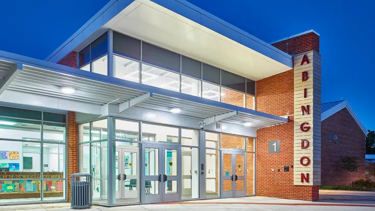

Abingdon Elementary School serves children in preschool through fifth grade in Arlington, Virginia.

Abingdon's PTA is an active and enthusiastic group of parents and teachers working together to give students the best possible experience during elementary school. Join us!

 &nbsp;&nbsp;&nbsp;  &nbsp;&nbsp;&nbsp;  &nbsp;&nbsp;&nbsp;  &nbsp;&nbsp;&nbsp; 

<h2>View the Latest Abingdon PTA News:</h2>

