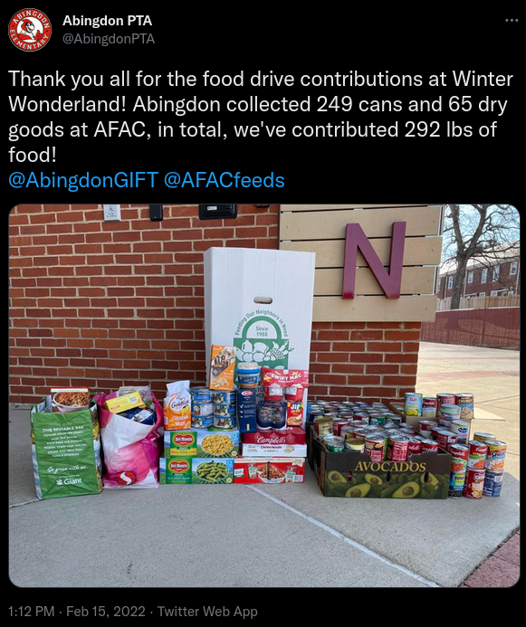
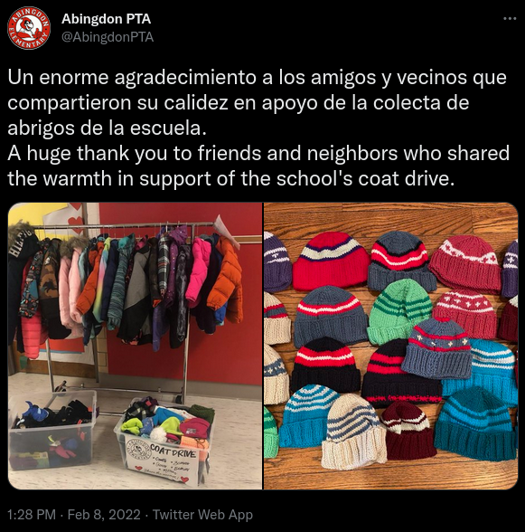
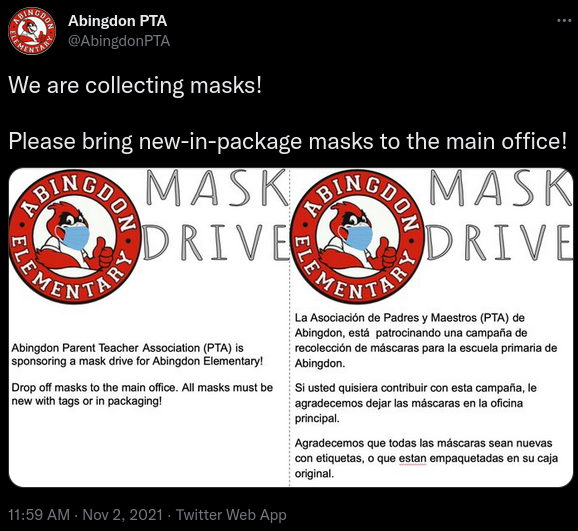
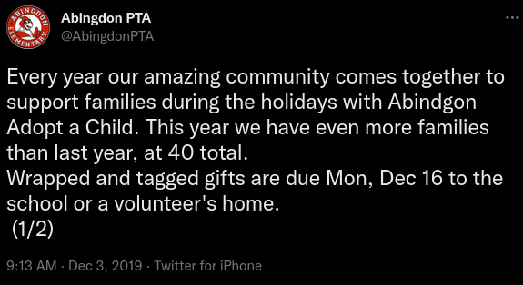

# Donation Drives

## Food Drive

The PTA organizes canned food drives, particularly during school events. A bin is placed in an accessible location and its contents are donated to the Arlington Food Assistance Center (AFAC).

## Winter Clothing Drive

The PTA supports Abingdon families by collecting winter clothing for children whose families cannot afford them. More information will be available this fall.

## School Supplies Drive

The PTA raises money for school supplies for children whose families cannot afford them.

## Mask Drive

The PTA raises money to buy high-quality masks to students, and also collects new masks in packaging to provide to students.

## Adopt-a-Family

The Abingdon PTA partners with the Student Support Team at Abingdon to help support families in need during the holiday season in our school community.

