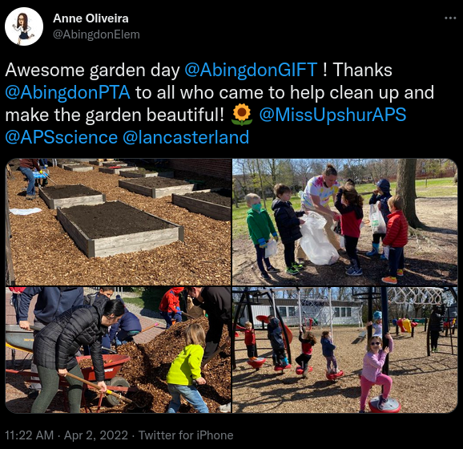
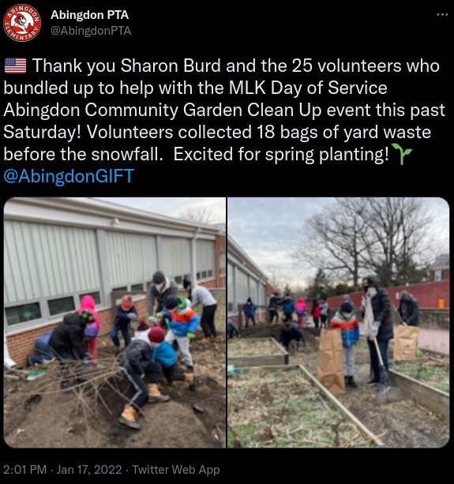
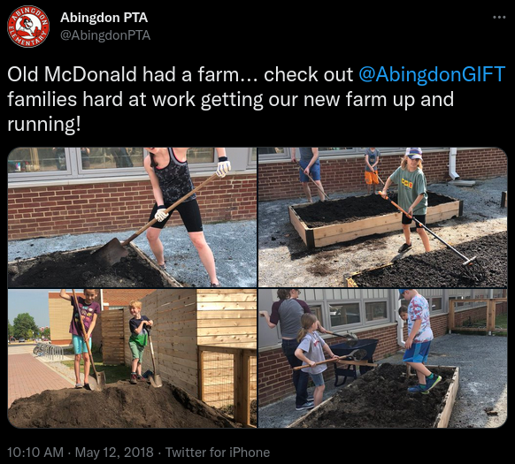

# Abingdon's Garden

Abingdon Elementary would love your support to create a successful, sustainable community garden.  It is our goal to enrich students' and families' knowledge of environmental sustainability and to be good stewards of our Earth, while providing first hand experience in learning about our food supply and our pollinators.

Click Here to Subscribe to our Garden Newsletter

