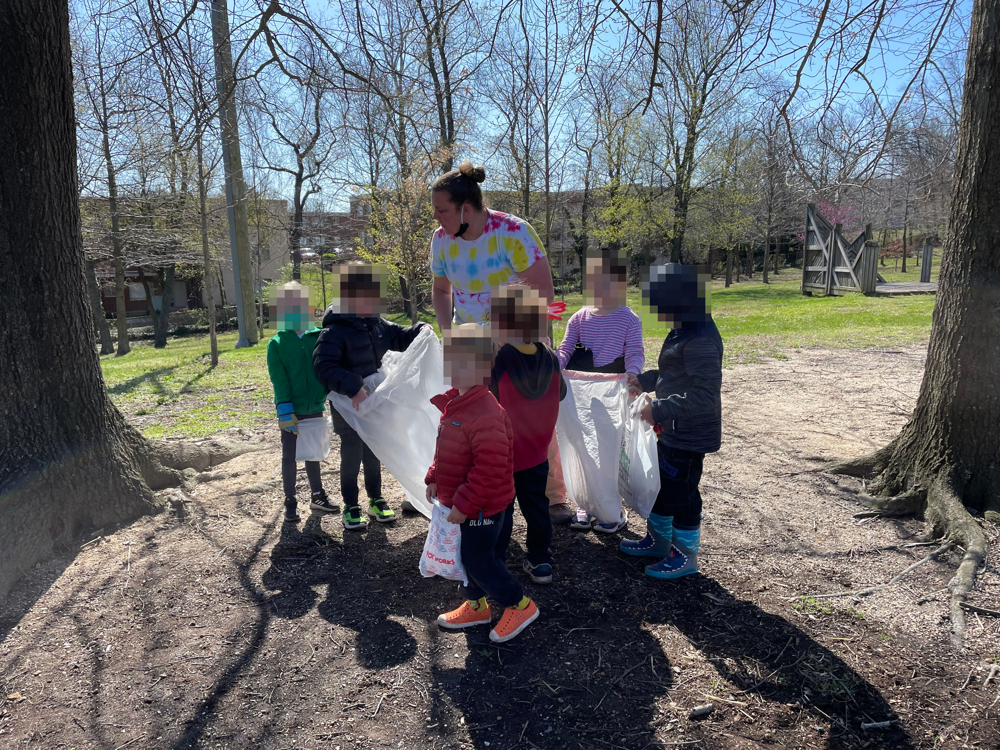

Abingdon Elementary would love your support to create a successful, sustainable community garden.  It is our goal to enrich students' and families' knowledge of environmental sustainability and to be good stewards of our Earth, while providing first hand experience in learning about our food supply and our pollinators.

If you're interested in volunteering in the garden, please subscribe to our Garden Newsletter below.

Click Here to Subscribe to our Garden Newsletter

## Earth Day Cleanup

## Donation of Woodchips and Stumps

## MLK Day of Service

## Before cleanup – December 2021

## May 2018

