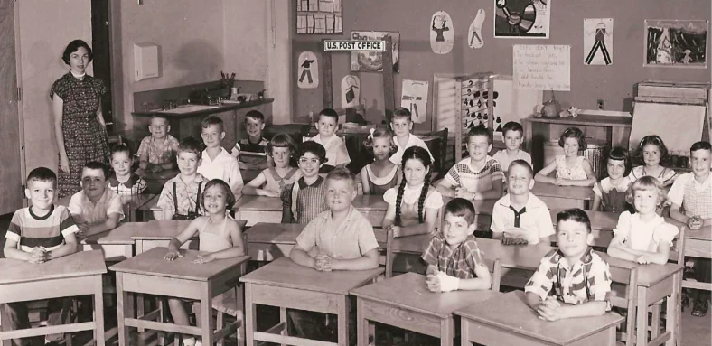

Abingdon first opened its doors to students in August 1950. The school has been in continuous operation since then, educating generations of students in South Arlington.

Below is a timeline of Abingdon's history gleaned from several sources, mostly newspaper articles. This timeline was largely made possible by a [newspaper digitizing project](https://library.arlingtonva.us/2021/06/21/search-thousands-of-historic-arlington-papers-online-for-free/) by Arlington Library's Center for Local History and the Library of Virginia. We are grateful for their efforts, and we intend to add more articles as their digitization efforts progress.

## Timeline

| Date | Source | Narrative | Clip |
| ---- | ------ | --------- | ---- |
| 1943-12-18 | Arlington Daily | Fairlington Elementary School opened on January 3, 1944, in the building currently used as the Fairlington Community Center. The school served the Fairlington neighborhood before Abingdon opened six years later. |  |
| 1947-01-31 | Arlington Daily | This was the first known mention of what would become Abingdon Elementary. Fairlington PTA members supported building an elementary school on what was then known as the "North Fairlington site" to relieve overcrowding at Fairlington Elementary. |  |
| 1947-09-18 | Arlington Daily | An addition was planned for Fairlington Elementary, possibly as an alternative to Abingdon. |  |
| 1947-10-10 | Sun | Fairlington Elementary was overcrowded and residents wanted a school in North Fairlington. |   |
| 1947-10-12 | The Washington Post | The Fairlington Civic Association polled North Fairlington residents and confirmed that they wanted a new school. |  |
| 1947-10-22 | The Washington Post | The Fairlington Civic Association polled North Fairlington residents and confirmed that they wanted a new school. |  |
| 1948-02-16 | The Washington Post | The new owners of Fairlington did not immediately turn over the land for the school to the county. |   |
| 1948-02-25 | The Washington Post | The county continued to have trouble obtaining the land for Abingdon. |  |
| 1948-04-14 | Arlington Daily | The county hired attorneys to obtain the land for Abingdon. |    |
| 1948-12-30 | Sun | The county came to an agreement with landowners about the location and the price of the land on which Abingdon would be built. |  |
| 1949-01-28 | Sun | The Fairlington Civic Association and the Fairlington Elementary PTA issued a joint report about Abingdon's specifications. |  |
| 1949-06-17 | The Washington Post | The county requested bids for the construction of Abingdon. |  |
| 1949-09-02 | Sun | The county accepted a bid for the construction of Abingdon. |  |
| 1949-10-02 | The Washington Post | Abingdon's name was announced. |  |
| 1949-10-07 | Sun | Abingdon's name was announced. It was named for the [Abingdon plantation](https://en.wikipedia.org/wiki/Abingdon_(plantation)). |  |
| 1949-10-30 | The Washington Post | Officials held a groundbreaking ceremony for Abingdon. This article includes an architect's rendering of what the school would look like upon completion. |  |
| 1949-11-04 | Sun | Officials held a groundbreaking ceremony for Abingdon. |  |
| 1950-06-02 | Sun | The Abingdon PTA held its first meeting on June 6, 1950. |  |
| 1950-06-23 | Sun | A photo of Abingdon's first principal. |  |
| 1950-08-18 | Sun | Officials announced the date and time of Abingdon's dedication. |  |
| 1950-08-21 | The Washington Post | Abingdon was dedicated on August 20, 1950. |  |
| 1950-09-22 | Sun | This article includes the first of many mentions of social events that were held at Abingdon. |  |
| 1950-11-03 | Sun | A rare early photo of the school's interior. |  |
| 1950-11-21 | Sun | Classes at Abingdon were already overcrowded in its first year. Eight of ten classrooms had more than 35 students, and four classrooms had 46 or 47 students. |  |
| 1951-02-09 | Sun | There was evidence of property destruction at Abingdon after club dances. |   |
| 1951-06-22 | Sun | Abingdon's first principal departed after one year. |  |
| 1951-08-26 | The Washington Post | Abingdon's second principal was announced. |  |
| 1953-08-23 | The Washington Post | Abingdon's third principal was announced. |  |
| 1955-03-01 | The Washington Post | The Abingdon PTA held a panel discussion about racial integration. |  |
| 1955-06-02 | Sun | A jitterbug contest was held at Abingdon. |  |
| 1955-12-13 | The Washington Post | The Fairlington Civic Association and the Abingdon PTA voted to oppose a state constitutional convention that was being organized to continue segregation in Virginia public schools. |  |
| 1956-07-27 | Daily Sun | A doll contest was held at Abingdon. |     |
| 1959-05-14 | Northern Virginia Sun | A festival being held at Abingdon was rained out. |  |
| 1961-01-30 | Northern Virginia Sun | Abingdon hired a new principal who would serve for ten years. |  |
| 1962-02-21 | Northern Virginia Sun | Abingdon students nervously watched John Glenn launch into space. |  |
| 1962-04-06 | Northern Virginia Sun | A costume show was held at Abingdon. |  |
| 1962-11-28 | Northern Virginia Sun | The county planned an addition at Abingdon that would add three or four classrooms and enlarge the library. |  |
| 1963-09-05 | Northern Virginia Sun | The planned addition would add a multi-purpose room for Abingdon and enlarge the library which at that point occupied a small, converted cloakroom. |  |
| 1963-10-28 | Northern Virginia Sun | A planned multi-purpose room would serve as a cafeteria, auditorium and gym. |  |
| 1964-02-20 | Northern Virginia Sun | A planned addition cited expectations for 14 elementary classrooms at Abingdon - it's not clear if that included the existing classrooms. |  |
| 1964-05-18 | Northern Virginia Sun | A spring festival, with students dancing, was held at Abingdon. |  |
| 1964-05-28 | Northern Virginia Sun | Abingdon held a groundbreaking for its new addition. |  |
| 1964-10-01 | Northern Virginia Sun | Abingdon introduced its new kindergarten program. |  |
| 1965-01-11 | Northern Virginia Sun | Abingdon held a dedication for its new library. |  |
| 1965-06-09 | Center for Local History | A publication titled "A Long Range Staff Development Program to Facilitate Effective Integration in the Arlington County Public Schools" ([Library URL](https://libcat.arlingtonva.us/Record/18721)) drafted by the school system stated that there were no Black students at Abingdon in 1965. |  |
| 1966-04-01 | Northern Virginia Sun | Though not directly related to Abingdon, the article noted that there were only two Black families living in Fairlington. This would have made it difficult to meaningfully integrate Abingdon. |  |
| 1966-04-04 | Northern Virginia Sun | Segregation in Fairlington, which was then a rental community, kept Abingdon segregated long after the Supreme Court had ruled that public school segregation was against the law. |  |
| 1966-09-28 | Northern Virginia Sun | Abingdon's principal was given lifetime PTA membership. |  |
| 1967-08-04 | Northern Virginia Sun | Abingdon bought temporary classroms to relieve overcrowding. |  |
| 1968-03-18 | The Washington Post | Abingdon's Fun Fair was advertised in the Washington Post. |  |
| 1968-05-25 | Northern Virginia Sun | Abingdon was slated to receive over a million dollars for a new addition in a bond referendum. |  |
| 1968-09-05 | Northern Virginia Sun | An editorial advocated for busing Abingdon students to Drew to relieve overcrowding. |  |
| 1969-11-25 | Northern Virginia Sun | The Northern Virginia Service League (now the Junior League of Northern Virginia) held a presentation on a pilot program strikingly similar to the modern-day Extended Day program. |  |
| 1969-11-26 | [Project DAPS](https://projectdaps.org/items/show/1421) | The racial breakdown of students in 1969 is the first known document to show that students of color were enrolled at Abingdon. |  |
| 1971-04-15 | Northern Virginia Sun | A former principal of another Arlington school advocated for busing Abingdon students to Drew to relieve overcrowding. |  |
| 1971-05-03 | Northern Virginia Sun | An editorial advocated for busing Abingdon students to Drew to relieve overcrowding. |  |
| 1971-1972 | [Arlington Historical Magazine](https://arlingtonhistoricalsociety.org/wp-content/uploads/2020/02/1996-4-Integration.pdf#page=10) | This is a snapshot of the demographics of Arlington elementary schools on the eve of a busing program aimed at racial integration of two formerly segregated schools. |  |
| 1974-12-18 | Northern Virginia Sun | This was the first mention of the potential closure of Fairlington Elementary School. |   |
| 1975-05-21 | Northern Virginia Sun | Abingdon hired a new principal. |  |
| 1975-05-21 | Northern Virginia Sun | Abingdon raised money for a field trip by collecting recycling. |  |
| 1977-03-23 | Northern Virginia Sun | Fairlington Elementary was restricted to grades 1-3. |  |
| 1978-12-08 | [The Washington Post](https://www.washingtonpost.com/archive/local/1978/12/08/arlington-board-votes-to-shut-three-schools/2b460734-f0ad-415d-ad0b-94ac105107df/) | Fairlington Elementary was shut down, and remaining students enrolled in Abingdon starting in the fall of 1979. |  |
| 1983-06-17 | [The Washington Post](https://www.washingtonpost.com/archive/local/1983/06/17/for-claremont-theres-no-tomorrow/3364fd7f-b1e4-4550-83c1-48a796f31c5a/) | Claremont Elementary was shut down, and remaining students enrolled in Abingdon starting in the fall of 1984. |   |
| 1984-11-07 | [The Washington Post](https://www.washingtonpost.com/archive/local/1984/11/07/volunteers-work-is-childs-play/ca319fea-11f5-4f64-befd-271dce5697f9/) | Abingdon students provided requirements to a celebrity playground architect. |   |
| 1985-03-14 | The Washington Post | The School Board proposed changes to Abingdon's school attendance boundaries. |  |
| 1986-09-05 | [The Washington Post](https://www.washingtonpost.com/archive/lifestyle/1986/09/05/playgrounds-to-test-the-mind-and-body/36469714-86de-40e7-9f70-e8dd65cd5bb6/) | A description of Abingdon's playground, listed in an article titled "Playgrounds to Test the Mind and Body." | 
| 1986-12-03 | [The Washington Post](https://www.washingtonpost.com/archive/local/1986/12/03/14-area-principals-honored-by-post/3b1a531d-a5fc-457e-98e8-dd862da126d7/) | Abingdon's principal was honored by the Washington Post. |  |
| 1988-02-19 | The Washington Post | A plan was proposed to place sixth grade students in middle schools, and to reopen Claremont Elementary as an extension of Abingdon. |  |
| 1988-04-15 | [The Washington Post](https://www.washingtonpost.com/archive/local/1988/04/15/school-plan-poorly-received/70d42adf-977d-4908-88de-ad2ffbbe032e/) | There was pushback to the plan to place sixth graders in middle schools and to reopen Claremont Elementary as an extension to Abingdon. (Claremont would reopen six years later.) |  |
| 1991-10-23 | [The Washington Post](https://www.washingtonpost.com/archive/lifestyle/food/1991/10/23/a-little-hands-on-harvest/1ccb80df-cb15-4e72-99a2-c27933032992/) | A feature about Abingdon's school garden. |   |
| 1993-11-30 | The Washington Post | Abingdon's principal was honored for distinguished leadership. |  |
| 1994-03-24 | [The Washington Post](https://www.washingtonpost.com/archive/local/1994/03/24/school-boundary-revisions-leave-frustrations/c206cf80-5735-4186-a1f1-a8e72f1c6635/) | Gunston Middle School opened and Abingdon families were excited to send their kids to the brand new school. Also, Claremont Elementary reopened, which reduced crowding at Abingdon. |   |
| 1995-12-03 | [The Washington Post](https://www.washingtonpost.com/archive/local/1995/12/03/in-step-with-her-students/92e7c073-7a7f-494a-882d-d55805f20721/) | A profile of race walking Abingdon teacher. |   |
| 1996-09-01 | The Washington Post | A list of quotes from Abingdon staff. |  |
| 1999-04-01 | [The Washington Post](https://www.washingtonpost.com/archive/local/1999/04/01/speaking-childrens-language/e24488ec-32df-43f0-afeb-2ff6eb5120c5/) | A profile of Abingdon's bilingual program. |   |
| 2001-03-29 | The Washington Post | A profile of a first-year teacher. |   |
| 2002-01-03 | [The Washington Post](https://www.washingtonpost.com/archive/local/2002/01/03/schools-may-merge-spanish-language-programs/a891da84-7d31-4308-add4-df124e50ba2d/) | The school board considered moving Abingdon's bilingual education program. |   |
| 2002-02-14 | [Connection Newspapers](http://www.connectionnewspapers.com/news/2002/feb/14/schools-consider-one-more-all-spanish-school/) | The school board considered moving Abingdon's bilingual education program. | |
| 2006-11-06 | [The Washington Post](https://www.washingtonpost.com/archive/local/2006/11/16/2-principals-honored-for-reviving-schools-span-classbankhead18-administrators-receive-post-awards-span/36f6db9a-5fed-4fcc-8f15-6a8fac56acee/) | Abingdon's principal was named Principal of the Year. | [PDF](images/PDF/2006-11-06.pdf) |
| 2006-12-10 | [Connection Newspapers](http://www.connectionnewspapers.com/news/2006/dec/10/principal-of-the-year-pushes-abingdon-forward/) | Abingdon's principal was named Principal of the Year. | |
| 2007-06-18 | [Connection Newspapers](http://www.connectionnewspapers.com/news/2007/jun/18/building-knowledge/) | A profile of Abingdon's architecture program. | |
| 2007-09-01 | Northern Virginia Magazine | Abingdon PTA worked to diversify its membership and boost participation. | [PDF](images/PDF/2007-09-01.pdf) |
| 2009-06-27 | [Sun-Gazette](https://www.insidenova.com/news/education/arlington/abingdon-elementary-wins-video-award/article_8ec52a92-febe-5519-b4d0-faa1f2adba13.html) | Abingdon received an award for a student-produced video. [Youtube link to video](https://www.youtube.com/watch?v=RzFa_JeHKVM) | |
| 2010-06-04 | [Sun-Gazette](https://www.insidenova.com/news/education/arlington/alpaca-poop-helps-to-fertilize-outdoor-classroom/article_ad096b40-e45c-5fe6-9760-e1a5a3203596.html) | Abingdon received a donation of Alpaca poop to help fertilize its garden. | |
| 2011-10-11 | [Sun-Gazette](https://www.insidenova.com/news/arlington/county-schools-honored-for-commitment-to-hunger-issues/article_4b617761-207c-5148-91ec-00fb98677f25.html) | Abingdon was honored for its commitment to fighting hunger through its food drives and donations from its garden. [Archived information available here.](https://web.archive.org/web/20111002042353/http://www.schoolsfighthunger.org/school/66338-abingdon-elemetnary.html) | |
| 2012-08-13 | [The Washington Post](https://www.washingtonpost.com/local/education/mobile-library-keeps-some-arlington-kids-reading-all-summer/2012/08/12/cc4c91b8-e2f4-11e1-a25e-15067bb31849_story.html) | Abingdon's Book Bus brings books to students during the summer. | [PDF](images/PDF/2012-08-13.pdf) |
| 2012-08-13 | [ArlNow](https://www.arlnow.com/2012/08/13/abingdon-elementary-summer-book-bus-deemed-a-success/) | Abingdon's Book Bus brings books to students during the summer. | |
| 2014-05-18 | [The Washington Post](https://www.washingtonpost.com/local/education/tablets-proliferate-in-nations-classrooms-and-take-a-swipe-at-the-status-quo/2014/05/17/faa27ba4-dbbd-11e3-8009-71de85b9c527_story.html) | Tablets were beginning to be used at Abingdon. | [PDF](images/PDF/2014-05-18.pdf) |
| 2014-07-10 | [Sun-Gazette](https://www.insidenova.com/news/arlington/arlington-school-officials-detail-costs-of-new-construction/article_c794bd86-081c-11e4-b042-0019bb2963f4.html) | The first article to describe the renovation that would take place in 2016-2017. | |
| 2014-07-13 | [Sun-Gazette](https://www.insidenova.com/news/arlington/arlington-educators-present-at-international-reading-conference/article_239f8fa0-0a8b-11e4-87b1-0019bb2963f4.html) | Abingdon staff spoke about the Book Bus at an international reading conference. | |
| 2014-08-31 | [Sun-Gazette](https://www.insidenova.com/news/arlington/architect-for-expansion-of-arlington-elementary-school-to-be-approved/article_1068b6b2-3111-11e4-add1-001a4bcf887a.html) | The School Board selected an architect for Abingdon's renovation. | |
| 2015-02-16 | [Sun-Gazette](https://www.insidenova.com/news/arlington/arlington-school-board-members-to-discuss-planned-abingdon-expansion/article_edfbb848-b551-11e4-9578-db292f4f42f8.html) | Arlington School Board members discuss the planned Abingdon renovation. | |
| 2015-03-23 | [Sun-Gazette](https://www.insidenova.com/news/arlington/abingdon-elementary-expansion-plan-approved/article_5ec06abe-d173-11e4-96de-cbff92342826.html) | The School Board approved conceptual designs for Abingdon's renovation. | |
| 2015-09-22 | [Sun-Gazette](https://www.insidenova.com/news/arlington/arlington-county-board-oks-expansion-of-abingdon-elementary/article_c8237516-611d-11e5-9aa9-7bdbcdc7f118.html) | The County Board approved Abingdon's renovation. | |
| 2015-09-22 | [ArlNow](https://www.arlnow.com/2015/09/22/abingdon-elementary-to-be-expanded-renovated/) | An article described Abingdon's planned renovation. | |
| 2015-10-14 | [The Washington Post](https://www.washingtonpost.com/local/arlington-school-counselor-and-teacher-pen-book-about-traveling-cat/2015/10/13/67b5e1fe-6d08-11e5-aa5b-f78a98956699_story.html) | An Abingdon teacher illustrated a book. | [PDF](images/PDF/2015-10-14.pdf) |
| 2016-02-22 | [Sun-Gazette](https://www.insidenova.com/news/arlington/final-design-for-elementary-school-expansion-nears-approval/article_c40b17ce-d8ad-11e5-8dbf-bf42c7855651.html) | The School Board was close to approving Abingdon's final renovation plans. | |
| 2016-04-05 | [ArlNow](https://www.arlnow.com/2016/04/05/relocatable-classrooms-at-abingdon-relocated-to-field/) | Relocatable classrooms were placed next to Abingdon in preparation for the renovation. | |
| 2017-05-18 | [Sun-Gazette](https://www.insidenova.com/news/arlington/progress-continues-on-abingdon-elementary-rebuild/article_200d430a-3bc0-11e7-b2f7-43bebb6ab0a7.html) | Progress continued on Abingdon's renovation. | |
| 2017-11-06 | [ArlNow](https://www.arlnow.com/2017/11/06/abingdon-elementarys-little-presidents-get-a-visit-from-nationals-racing-presidents/) | Washington Nationals’ racing presidents paid a surprise visit to Abingdon and partied with Abingdon's own "Little Presidents." | |
| 2018-04-13 | [ArlNow](https://www.arlnow.com/2018/04/13/morning-notes-1882/) | Abingdon had a ribbon cutting for their completed renovations. | |
| 2018-06-12 | [ArlNow](https://www.arlnow.com/2018/06/12/abingdon-elementarys-little-presidents-join-nats-park-presidents-race/) | Abingdon’s "Little Presidents" visit Nationals Park to be on the field with the Nationals' presidents. | |
| 2018-12-06 | [The Washington Post](https://www.washingtonpost.com/local/education/as-arlington-rezones-schools-communities-fight-to-stay-together/2018/12/05/97102b7c-f337-11e8-80d0-f7e1948d55f4_story.html) | Changes to Abingdon's boundaries were divisive. | [PDF](images/PDF/2018-12-06.pdf) |
| 2019-06-22 | [Sun-Gazette](https://www.insidenova.com/news/education/fairfax-educator-tapped-to-be-new-principal-in-arlington/article_56731a0e-94f7-11e9-92ad-5b20ffed75a3.html) | Abingdon hired a new principal. | |
| 2019-12-11 | [Good Morning America](https://www.goodmorningamerica.com/living/story/stem-program-girls-rosie-riveters-list-fulfilled-amazon-67608034) | Good Morning America recorded a segment at Abingdon in which they and Amazon donated products to Abingdon. | |

## Principals

| Name | Tenure |
| ---- | ------ |
| Mary Barbour | 1950-1951 |
| Patty Hales | 1951-1953 |
| Corinne Jeffries | 1953-1960? |
| Dicie Woodson | 1960?-1961? |
| Irene B. Young | 1961-1971 |
| John Kiernan | 1971-1975 |
| James Kacsmarik | 1975-? |
| Margaret McCourt-Dirner | 1984, 1986 |
| Marjorie "Meg" R. Tuccillo | 1990-1997 |
| Miguel Ley | 1998-2001 |
| Joanne Uyeda | 2001-2019 |
| David Horak | 2019-present |

## Renovations/Additions

| Year | Added |
| ---- | ----- |
| 1949-1950 | Initial construction. Ten classrooms, a multi-purpose room, a library, offices for the principal and secretary, a teacher's lounge, a kitchen and a storage room. |
| 1964-1965 | A new library, and probably more (9 classrooms? a conference room?) |
| 1970-1971 | 15 classrooms, media center, gymnasium, conference rooms for reading, music, science, art, an office and additional storage space. And air conditioning for the entire school except the gym. |
| 1990 | Unknown |
| [2016-2017](https://www.apsva.us/design-and-construction/abingdon-additionrenovations/) | 12 new classrooms, a new gymnasium, a new kitchen, and an outdoor instructional area. |

## Other Documents

| Document | Link |
| -------- | ---- |
| A history of Abingdon Elementary, written in March 1971. | [PDF](images/PDF/Abingdon%20Elementary%20History.pdf) |
| Architectural and mechanical report for proposed additions and alterations to Oakridge and Abingdon elementary schools, published in 1968. ([library URL](https://libcat.arlingtonva.us/Record/10555)) | [PDF](images/PDF/Addition%20Plan%201968.pdf) |