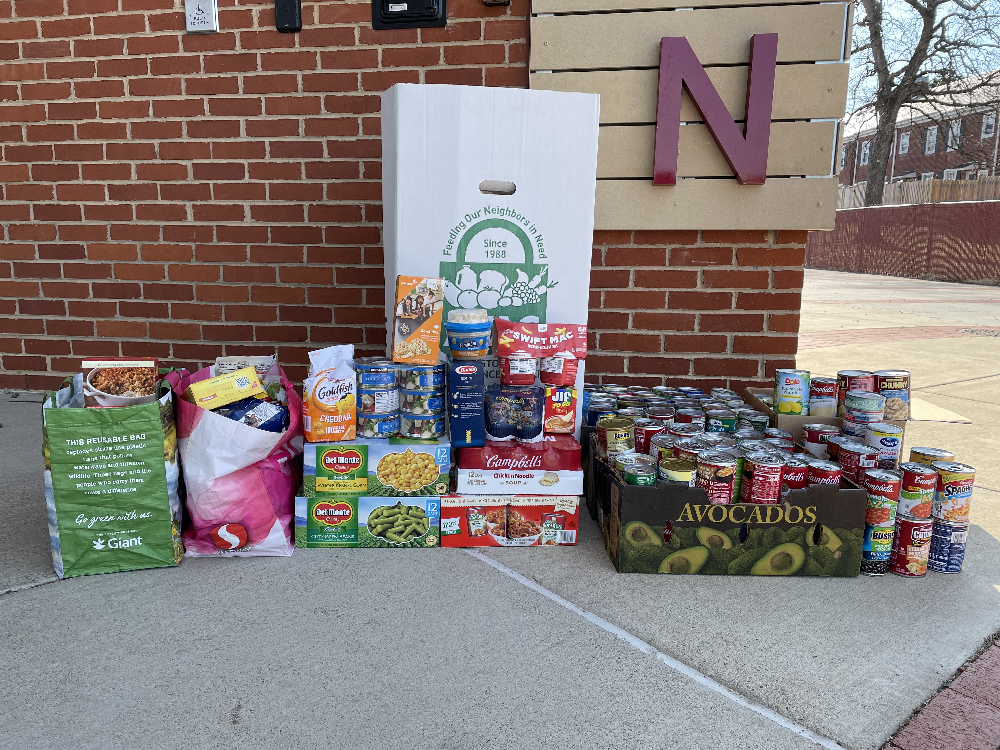
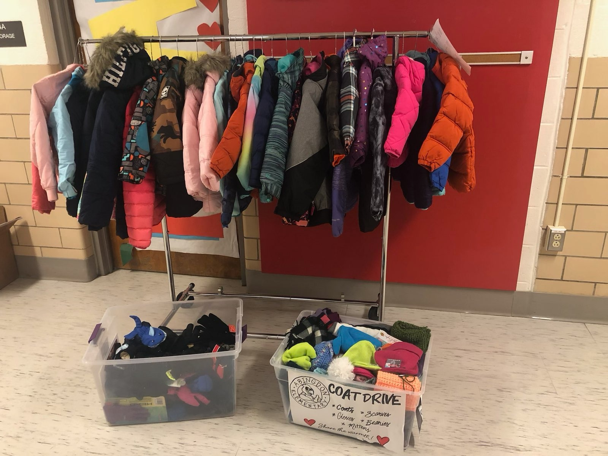
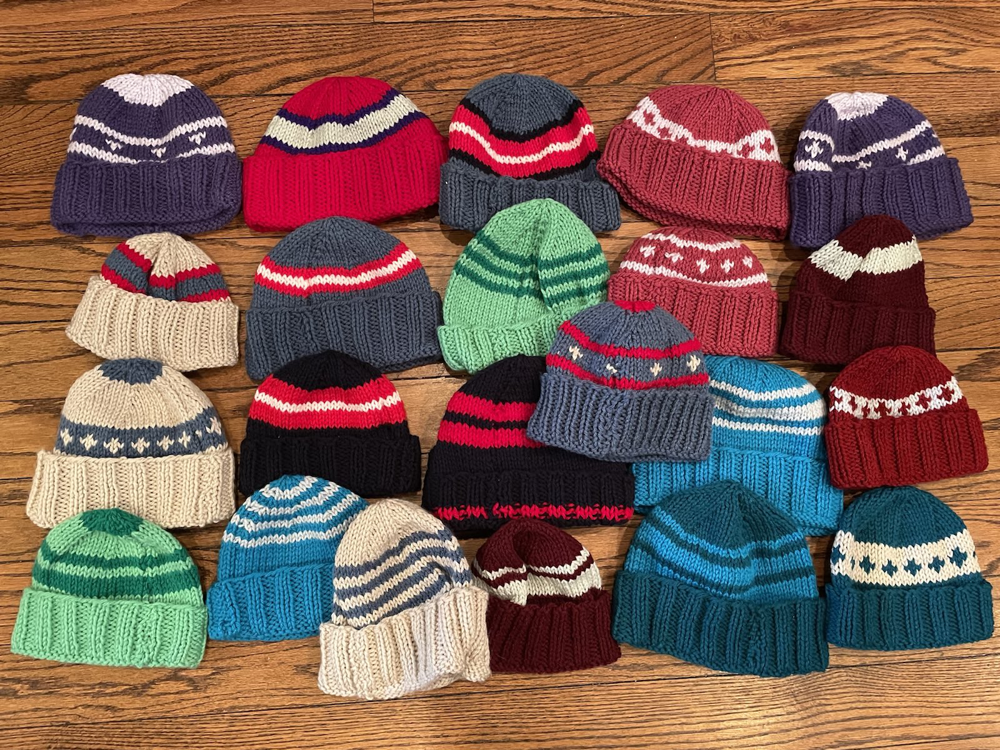
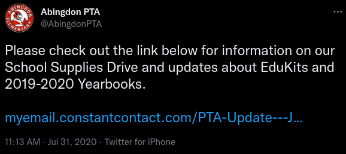
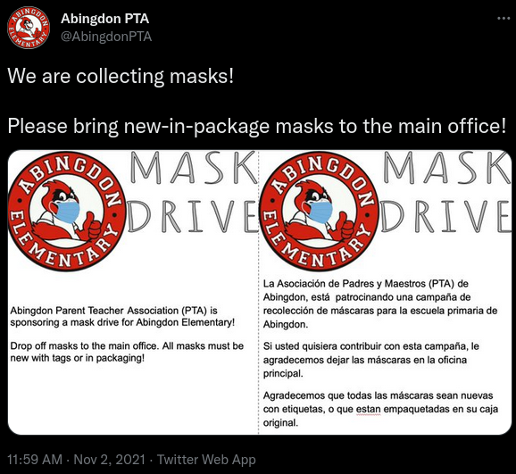

The Abingdon PTA organizes many donation drives for our school community.

If you're interested in helping to organize our donation drives, please [fill out our volunteer form](https://docs.google.com/forms/d/e/1FAIpQLSdk4KJFIDuigz-EyhdPuWM_GejjZ5rpx9emd6jHxb2xKPQgGA/viewform?usp=sf_link).

## Food Drive

The PTA organizes canned food drives, particularly during school events. A bin is placed in an accessible location and its contents are donated to the Arlington Food Assistance Center (AFAC).

  
During Winter Wonderland 2022, Abingdon collected 249 cans and 65 dry goods for AFAC - a total of 292 lbs of food!

## Winter Clothing Drive

The PTA supports Abingdon families by collecting winter clothing for children whose families cannot afford them. More information will be available this fall.

  
**Left**: Donated clothing. **Right**: Hats lovingly knitted and donated by a dedicated volunteer.

## Adopt-a-Family

The Abingdon PTA partners with the Student Support Team at Abingdon to help support families in need during the holiday season in our school community.

## School Supplies Drive

The PTA raises money for school supplies for children whose families cannot afford them.

## Mask Drive

The PTA raises money to buy high-quality masks to students, and also collects new masks in packaging to provide to students.

