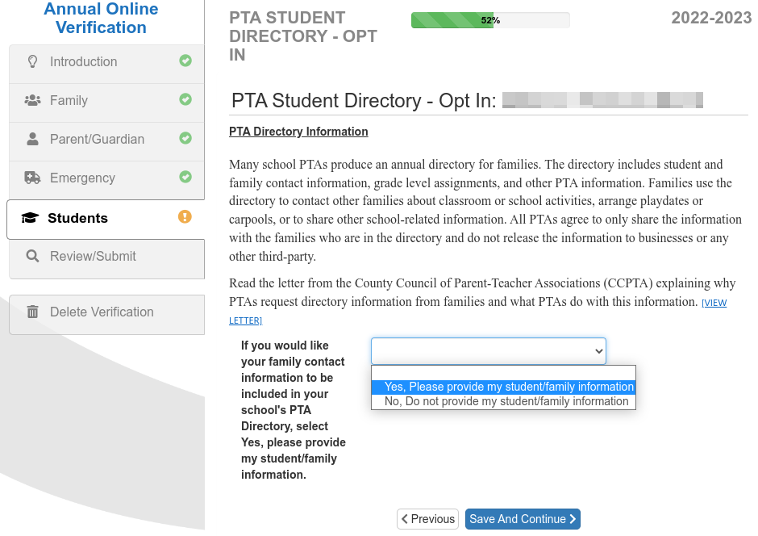

--- 
title: How to Opt-in to Our Online Directory This Year
summary: The PTA will publish an online student directory this year, but you must opt-in to be listed in the directory, or to view it.
slug: directory
date: 2022-08-29T07:00:00-04:00
draft: true
---

The PTA is working with a vendor to publish an online student directory this school year. This frequently-requested resource will strengthen our community by facilitating birthdays, playdates, and other social occasions amongst Abingdon students.

Families must opt-in to be listed in the directory. This is done through the [Annual Online Verification Process (AOVP)](https://www.apsva.us/registering-your-child/annual-online-verification-process/), the online forms that families must complete at the start of each school year. The opt-in question looks like this (and must be answered separately for each student):

Answering “yes” is all that you need to do to ensure that your child is included in the directory. When the directory is ready, the PTA will send emails to the email addresses on record within ParentVUE with instructions for accessing the directory.


**If you do not opt-in to be listed in the directory, you will not be provided access to the directory.**


The deadline for completing the AOVP is October 31, 2022, so we intend to make the directory available as soon as possible after that.

<!--https://www.apsva.us/wp-content/uploads/2022/08/AOVP-OptIn-Letter-7-27-22.pdf-->
