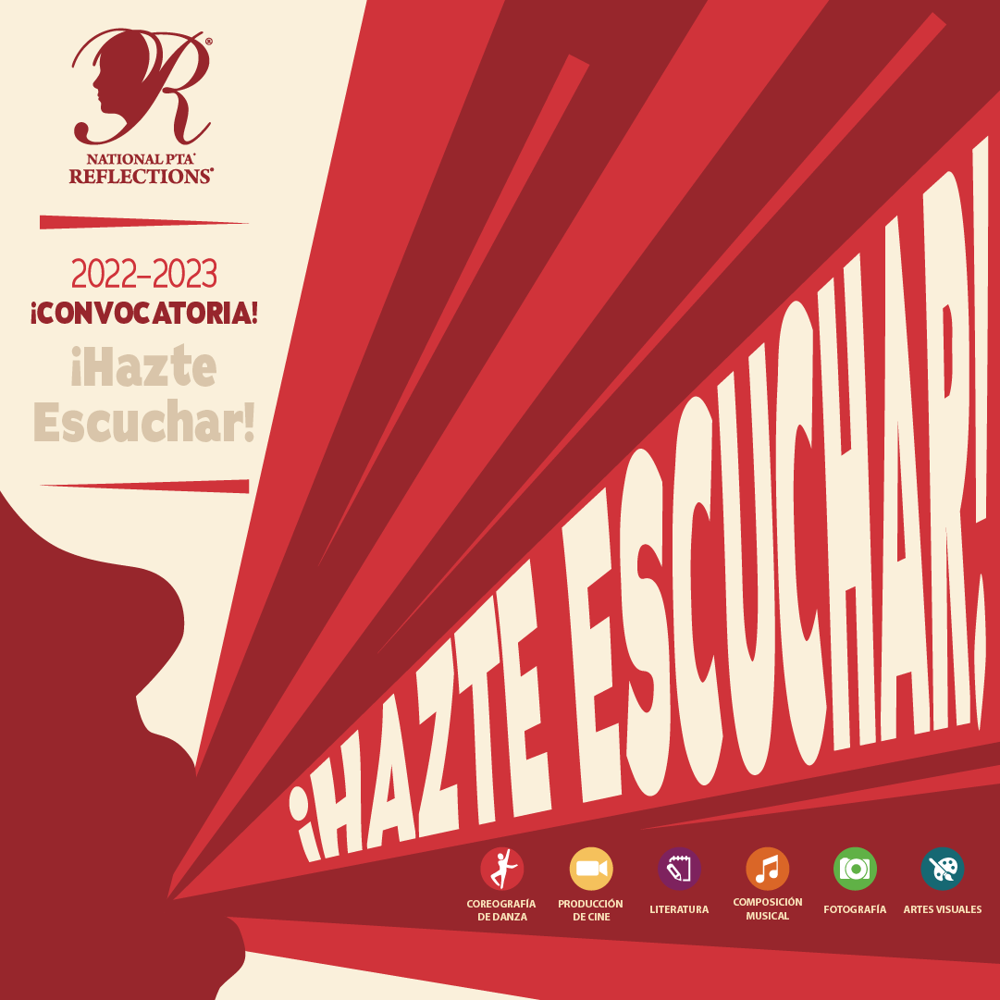

--- 
title: Convocatoria de participación — Concurso de arte Reflections
summary: Infórmese sobre el concurso de arte Reflections que la PTA de Abingdon está organizando este otoño.
slug: reflections
date: 2022-09-07T05:00:00-04:00
images:
    - social/r---show-your-voice_facebook-cropped.webp
aliases:
    - /es/reflections/
categories: reflections
---

Reflections es un programa patrocinado por la PTA nacional que anima a los estudiantes a expresarse artísticamente. Cada año, la PTA Nacional selecciona un tema y los estudiantes crean y envían una obra de arte que refleja el tema.

El tema de este año es **Hazte Escuchar**.

## Acerca de la competencia

Todos los estudiantes de Abingdon están invitados a crear obras de arte basadas en temas en las categorías de **literatura** (obras escritas) y **artes visuales** (pinturas, esculturas, dibujos y grabados). Todas las obras de arte serán reconocidas, celebradas y juzgadas por voluntarios de Abingdon por divisiones de nivel de grado. Una selección de entradas avanzará a la competencia en todo el condado.

## Instrucciones de participación

Cree una obra de arte visual o literatura que refleje el tema de este año de Show Your Voice. Asegúrese de que cumpla con las pautas publicadas por la PTA Nacional ([Arte Visual](guides/Spanish/visual-arts-cat-guidelines_reflections-es.pdf), [Literatura](guides/Spanish/literature-cat-guidelines_reflections-es.pdf)).

1. Etiquete claramente la parte posterior o inferior de su trabajo con su nombre, el nombre de su maestro y el título de su trabajo.
1. Deje con cuidado su trabajo en el contenedor de Reflections dentro de la escuela. **El contenedor para envíos está justo dentro de la entrada principal de la escuela (Puerta 1).**
1. Rellena nuestro Formulario de Inscripción ([Inglés](forms/fillable-form_local-leader.pdf), [Español](forms/fillable-form_local-leader---es.pdf)) y envíalo a abingdonreflections@gmail.com.

Si tiene alguna pregunta, envíenos un correo electrónico a abingdonreflections@gmail.com.


Envíe su arte y su formulario de inscripción antes del **jueves 20 de octubre** para poder participar.


¡Muchas gracias, y estamos emocionados de ver lo que creas!