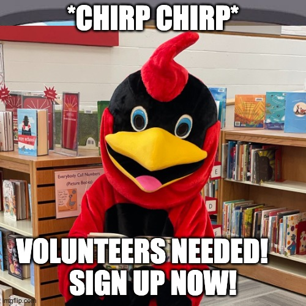

## Mensaje del presidente

Estimados amigos y familias de Abingdon,

Espero que sus cardenales estén teniendo un buen comienzo del año escolar. Disfruté ver a familias que regresan y conocer nuevos estudiantes y educadores que se unieron recientemente a nuestra escuela. Fue conmovedor ver a nuestros compañeros cardenales hacer nuevos amigos en nuestro picnic de regreso a la escuela y en las crecientes fechas de juegos de helados de verano de jardín de infantes. Su equipo de PTA está emocionado de continuar construyendo y fortaleciendo nuestra comunidad de Abingdon a través de nuestros eventos, actividades y programas.

Todos son bienvenidos a participar en la PTA; sin embargo, considere convertirse en un miembro que paga cuotas (un requisito en nuestra organización para votar; [pague sus cuotas aquí](https://abingdonpta.memberhub.com/store/items/717576)). También lo animo a que preste una hora de su tiempo para ser voluntario con nosotros también. Hay varias formas de conectarse con la PTA de Abingdon. Además de actualizar periódicamente [Facebook](https://www.facebook.com/AbingdonElementaryPTA), [Twitter](https://twitter.com/AbingdonPTA) y [www.abingdonpta.org](https://www.abingdonpta.org), también lanzamos [grupos de WhatsApp](/whatsapp/) para que las familias se conecten entre sí.

Como compartió Elizabeth Andrew, “Los voluntarios no necesariamente tienen el tiempo; tienen el corazón”. Ayúdanos a ser un fuerte y poderoso defensor de nuestro rebaño de cardenales. Espero conocerte; Si me ves por casualidad, por favor pasa a decir "¡Hola!"

Con agradecimiento,
sharon burd
Presidente de la Asociación de Padres y Maestros

[No olvide vincular su tarjeta VIC de Harris Teeter a Abingdon Elementary.](https://docs.google.com/forms/d/e/1FAIpQLSeiAe72qt4qTb_b2xmB-TUZByVkD-QxfVNyFEEHGc6sGkFzYQ/viewform) Actualmente tenemos 54 participantes para esta escuela año.

## 📅 ​​Guarda las fechas

- **Jueves 8 de septiembre**, 6:30 – 7:45 p. m.: Noche de regreso a la escuela en Abingdon
- **Domingo 11 de septiembre**: Cierre de inscripciones para clases de enriquecimiento de otoño
- **Lunes 12 de septiembre**, 7:00 p. m.: reunión de la PTA de septiembre
- **Jueves 15 de septiembre**: Día de la fotografía de otoño
- **Lunes 19 de septiembre**: comienzan las clases de enriquecimiento de otoño
- **Jueves 22 de septiembre**: Noche de la Ciencia
- **Lunes 26 de septiembre**: Rosh Hashaná - No hay clases
- **Miércoles 5 de octubre**: Yom Kippur - No hay clases

Nota: Vea y suscríbase al calendario de la PTA en nuestro nuevo sitio web [aquí](/calendar).

## 👋 Primera reunión virtual de membresía general de la PTA el lunes 12 de septiembre

Está invitado a nuestra primera reunión virtual de la PTA del año escolar el **lunes 12 de septiembre a las 7:00 p. m.**, en Zoom. Ven a conocer a nuestro equipo de PTA. El director Horak también entregará su informe mensual con una sesión de preguntas y respuestas después. Le pediremos a nuestra membresía general que vote sobre algunos, como nuestro presupuesto propuesto de la PTA. Revise nuestra agenda [aquí](/agendas/2022-09-12).

> Por razones de seguridad, no compartimos los códigos de reunión de Zoom en nuestro sitio web. [Suscríbase a nuestro boletín, Cardinal Courier](https://us11.list-manage.com/subscribe?u=e8c2877018f64aa7e1fd2e884&id=b884e2a18e), para asegurarse de recibir los códigos de reunión de la PTA.

## 🏫 Regístrese para las clases de otoño de enriquecimiento después de la escuela

La inscripción para las clases de enriquecimiento extraescolares de otoño a través de Baroody Camps se ha EXTENDIDO hasta este **domingo 11 de septiembre**. Las clases de enriquecimiento comienzan el **lunes 19 de septiembre**. La PTA de Abingdon se complace en coordinar con nuestro proveedor y el personal de Abingdon para ofrecer estas maravillosas clases, como ballet, ingeniería, teatro, codificación, arcilla y ciencias. Regístrese [aquí](https://bc-arl-abingdon.jumbula.com/#/fall-2022).

## 📸 El día de la foto es el jueves 15 de septiembre

Los formularios de pedido de Lifetouch Picture Day se colocaron en los buzones de correo de los maestros para distribuirlos en las mochilas de los estudiantes esta semana. Si prefiere pagar en línea, visite [el sitio de Lifetouch](https://my.lifetouch.com/mylifetouch/#/) e ingrese el ID de Picture Day de Abingdon:

> Por motivos de seguridad, no compartimos los códigos Lifetouch Picture Day en nuestro sitio web. [Suscríbase a nuestro boletín, Cardinal Courier](https://us11.list-manage.com/subscribe?u=e8c2877018f64aa7e1fd2e884&id=b884e2a18e), para asegurarse de recibir los códigos Lifetouch Picture Day.

## 📱 Directorio de estudiantes próximamente

La PTA de Abingdon está creando un **directorio de estudiantes en línea** para el año escolar 2022-2023 para conectar a las familias de Abingdon (por ejemplo, organizar citas para jugar o viajes compartidos o discutir oportunidades de voluntariado). Contendrá información solo para aquellas familias que han **optado** compartir dicha información con la PTA como parte del Proceso de verificación anual en línea (AOVP) que todas las familias completan anualmente. **Solo aquellas familias que "opten por participar" tendrán acceso al directorio**. Revise el anuncio reciente [aquí](/2022/09/06/directory).

## 🎨 Concurso de Arte Reflexiones

Nuestra PTA está participando en Reflections, un programa nacional patrocinado por la PTA que anima a los estudiantes a expresarse artísticamente. Estamos llamando a todos los estudiantes de Abingdon a crear arte visual o literatura que refleje el tema de este año: "**Hazte Escuchar**". Los estudiantes pueden crear obras de arte basadas en temas en las categorías de **literatura** (obras escritas) y **artes visuales** (pinturas, esculturas, dibujos y grabados). Todas las obras de arte serán reconocidas, celebradas y juzgadas por voluntarios de Abingdon por divisiones de nivel de grado. Una selección de entradas avanzará a la competencia en todo el condado. ¡Estamos emocionados de ver tu talento! Más información [aquí](/reflections/).

## 🫶 Voluntario con nosotros

Complete el [formulario de voluntariado de la PTA](https://docs.google.com/forms/d/e/1FAIpQLSf50HFDkNfDxP5VfE2LzsxKbUPZdmRGQTeNEUhXkU_qLCLWZQ/viewform?usp=sf_link) para que podamos obtener más información sobre sus intereses, habilidades y disponibilidad. Nos encantaría encontrarle una oportunidad de voluntariado o un puesto continuo que funcione para usted. Además, APS requiere que todos los padres que se ofrecen como voluntarios en el edificio completen una [Solicitud de Voluntario de APS ](https://abingdon.apsva.us/families/volunteer/); envíe la solicitud si aún no lo ha hecho este año o el año escolar pasado. Para iniciar el proceso, complete la solicitud en [inglés](https://apps.raptortech.com/Apply/MjQyMDplbi1VUw==) o [español](https://apps.raptortech.com/Apply/MjQyMDplcy1VUw==), y envíe un correo electrónico a [nicole.jondahl@apsva.us](mailto:nicole.jondahl@apsva.us). Más información [aquí](https://abingdon.apsva.us/families/volunteer/).

**Regístrese para nuestras oportunidades de voluntariado:**

- **Día de Fotos** — La PTA necesita ayuda para que el Día de Fotos de Abingdon se lleve a cabo sin problemas el **15 de septiembre**. Si está interesado en ayudar, comuníquese con abingdonptapresident@gmail.com.
- **Girls on the Run** — Estamos interesados ​​en comenzar [Girls on the Run](https://www.girlsontherun.org/) esta primavera. Si tiene interés en apoyar a nuestros estudiantes como entrenador, comuníquese con Ashley Farrugia: ashleybethmccarthy@gmail.com.
- **Suministros de fonética**: la Sra. Naomi Holly, especialista en lectura de Abingdon, coordinará a los voluntarios para ayudar a etiquetar los suministros de fonética. Si está interesado, [regístrese aquí](https://www.signupgenius.com/go/30e0a44aca72aa5fe3-literacy) o comuníquese con naomi.holly@apsva.us.
- **Laminación de carteles**: la Sra. Vasthy Delgado, consejera escolar en Abingdon, está buscando ayuda para plastificar carteles. Si está interesado, [regístrese aquí](https://www.signupgenius.com/go/30e0a44aca72aa5fe3-laminating) o comuníquese con [vasthy.delgado2@apsva.us](mailto:vasthy.delgado2@apsva. a nosotros).
- **School Garden**: para recibir actualizaciones sobre oportunidades de voluntariado en el jardín, [regístrese aquí](https://us10.list-manage.com/subscribe?u=f9c2cb9188c78232702100f91&id=50d30d2a32).
- **Noche de Ciencias** — La Sra. Renita Upshur, maestra de ciencias en Abingdon, está organizando una Noche de Ciencias en la escuela el **22 de septiembre**. Ella necesita voluntarios para ayudar con la instalación, el funcionamiento de las estaciones y el desmontaje de las estaciones. El horario de voluntariado es de 5:15 a 7:45 p. m. Los voluntarios deben tener más de 18 años. Si está interesado, [regístrese aquí](https://www.signupgenius.com/go/20F0D48AAA62BA5F58-science). Si tiene alguna pregunta, comuníquese con Renita.Upshur@apsva.us.

## ☕ Convocatoria de donaciones de café



La PTA está solicitando donaciones de K-Cup con cafeína para nuestros excepcionales educadores de Abingdon. Envíe las donaciones a la oficina principal de Abingdon, con la etiqueta "PTA", o envíelas a:

> Abingdon PTA  
> 3035 S Abingdon St  
> Arlington, VA 22206

## 🙏 ¡Gracias!

Un enorme agradecimiento a la coordinadora de voluntarios de EduKit, Samantha Levine-Finley, y al equipo (Tina, Lisa, Mercedes, Clare y Dan) por prestar su tiempo y energía para distribuir EduKits en las aulas antes de que comenzaran las clases.

También, gracias a nuestro equipo de riego de verano - Pat, Lauren, Amy, Matt y Karen - por ser nuestros guardianes del jardín escolar durante las vacaciones de verano.

## ✨ La gran sorpresa de Cardinal

¡El Cardenal de Abingdon realizó una excursión a la Feria del Condado de Arlington el mes pasado y quedó asombrado al ver los premiados okra, pimientos banana, menta, albahaca, tomates y zinnia de Abingdon!

