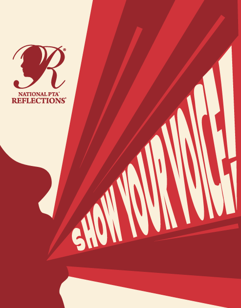

Click here to receive the Cardinal Courier newsletter in your inbox.

## President's Message

Dear Abingdon Friends and Families,

I hope your cardinals are having a strong start to the school year. I've enjoyed seeing returning families and meeting new students and educators who recently joined our school. It was heartwarming to see our fellow cardinals make new friends at our Back-to-School Picnic and at the rising Kindergarten Summer Popsicle Playdates. Your PTA team is excited to continue building and strengthening our Abingdon community through our events, activities, and programs.

Everybody is welcome to participate in the PTA; however, consider becoming a dues paying member (a requirement in our organization for voting; [pay your dues here](https://abingdonpta.memberhub.com/store/items/717576)). I would also encourage you to lend an hour of your time to volunteer with us too. There are several ways to connect with the Abingdon PTA. In addition to regularly updating [Facebook](https://www.facebook.com/AbingdonElementaryPTA), [Twitter](https://twitter.com/AbingdonPTA), and [www.abingdonpta.org](https://www.abingdonpta.org), we also launched [WhatsApp groups](/whatsapp/) for families to connect with each other.

As Elizabeth Andrew shared, “Volunteers do not necessarily have the time; they have the heart.” Help us be a strong and powerful advocate for our flock of cardinals. I look forward to meeting you; if you happen to see me, please stop by to say “Hello!”

Gratefully,  
Sharon Burd  
PTA President

P.S. [Don’t forget to link your Harris Teeter VIC card to Abingdon Elementary.](https://docs.google.com/forms/d/e/1FAIpQLSeiAe72qt4qTb_b2xmB-TUZByVkD-QxfVNyFEEHGc6sGkFzYQ/viewform) We currently have 54 participants for this school year.

## 📅 Save the Dates

- **Thursday, September 8**, 6:30 – 7:45 PM: Abingdon’s Back to School Night
- **Sunday, September 11**: Registration closes for Fall Enrichment classes
- **Monday, September 12**, 7:00 PM: September PTA meeting
- **Thursday, September 15**: Fall Picture Day
- **Monday, September 19**: Fall Enrichment classes begin
- **Thursday, September 22**: Science Night
- **Monday, September 26**: Rosh Hashanah - No school
- **Wednesday, October 5**: Yom Kippur - No school

Note: View and subscribe to the PTA calendar on our new website [here](/calendar).

## 👋 First PTA General Membership Virtual Meeting on Monday, September 12

You’re invited to our first PTA virtual meeting of the school year on **Monday, September 12 at 7:00 PM**, on Zoom. Come meet our PTA team. Principal Horak will also deliver his monthly report with a question and answer session afterwards. We’ll be asking our General Membership to vote on a few such as our proposed PTA budget. Please review our agenda [here](/agendas/2022-09-12).

> For security reasons, we do not share Zoom meeting codes on our website. [Please subscribe to the email edition of our newsletter](https://lp.constantcontactpages.com/su/t3ku1aP) to make sure you receive PTA meeting codes.

## 🏫 Register for After-School Enrichment Fall Classes

Registration for Fall after-school enrichment classes through Baroody Camps has been EXTENDED until this **Sunday, September 11**. Enrichment classes start on **Monday, September 19**. The Abingdon PTA is excited to coordinate with our vendor and Abingdon staff to offer these wonderful classes such as ballet, engineering, theater, coding, clay, and science. Register [here](https://bc-arl-abingdon.jumbula.com/#/fall-2022).

## 📸 Picture Day is Thursday, September 15

Lifetouch Picture Day order forms were placed in teacher’s mailboxes to be distributed in students’ backpacks this week. If you would prefer to pay online, visit [the Lifetouch site](https://my.lifetouch.com/mylifetouch/#/) and enter Abingdon's Picture Day ID:

> For security reasons, we do not share Lifetouch Picture Day codes on our website. [Please subscribe to the email edition of our newsletter](https://lp.constantcontactpages.com/su/t3ku1aP) to make sure you receive Lifetouch Picture Day codes.

## 📱 Student Directory Coming Soon

The Abingdon PTA is creating an **online student directory** for the 2022-2023 school year to connect Abingdon families (e.g., arrange playdates or carpools or discuss volunteer opportunities). It will contain information for only those families who have **opted in** to share such information with the PTA as part of the Annual Online Verification Process (AOVP) that all families complete annually. **Only those families who “opt in” will have access to the directory**. Review the recent announcement [here](/2022/09/06/directory).

## 🎨 Reflections Art Contest

Our PTA is participating in Reflections - a national PTA-sponsored program that encourages students to express themselves artistically. We’re calling all Abingdon students to create visual art or literature reflecting this year’s theme: “Show Your Voice.” Students can create theme-based artwork in the categories of **literature** (written works) and **visual arts** (paintings, sculptures, drawings, and prints). All artworks will be recognized, celebrated, and judged by Abingdon volunteers by grade-level divisions. A selection of entries will advance to the county-wide competition. We are excited to see your talent! More info [here](/reflections/).

## 🫶 Volunteer with Us

Please complete the [PTA's volunteer form](https://docs.google.com/forms/d/e/1FAIpQLSf50HFDkNfDxP5VfE2LzsxKbUPZdmRGQTeNEUhXkU_qLCLWZQ/viewform?usp=sf_link) so that we can learn more about your interests, skills, and availability. We'd love to match you with a volunteer opportunity or an ongoing role that works for you. Additionally, APS requires that all parents volunteering in the building complete an APS [Volunteer Application](https://abingdon.apsva.us/families/volunteer/); submit the application if you have not already done so this year or last school year. To initiate the process, complete the [English](https://apps.raptortech.com/Apply/MjQyMDplbi1VUw==) or [Spanish](https://apps.raptortech.com/Apply/MjQyMDplcy1VUw==) application, and email [nicole.jondahl@apsva.us](mailto:nicole.jondahl@apsva.us). More info [here](https://abingdon.apsva.us/families/volunteer/).

**Sign up for our volunteer opportunities:**

- **Picture Day** — The PTA needs help making Abingdon’s Picture Day run smoothly on **September 15**. If you’re interested in helping, contact abingdonptapresident@gmail.com.
- **Girls on the Run** — We are interested in starting [Girls on the Run](https://www.girlsontherun.org/) this spring. If you have interest in supporting our students as a coach, please reach out to Ashley Farrugia: ashleybethmccarthy@gmail.com.
- **Phonics Supplies** — Ms. Naomi Holly, reading specialist at Abingdon, will be coordinating volunteers to help label phonics supplies. If you are interested, [please sign up here](https://www.signupgenius.com/go/30e0a44aca72aa5fe3-literacy) or contact naomi.holly@apsva.us.
- **Laminating Posters** — Ms. Vasthy Delgado, school counselor at Abingdon, is seeking help laminating posters. If you are interested, [please sign up here](https://www.signupgenius.com/go/30e0a44aca72aa5fe3-laminating) or reach out to [vasthy.delgado2@apsva.us](mailto:vasthy.delgado2@apsva.us).
- **School Garden**  — To receive updates about garden volunteer opportunities, [please sign up here](https://lp.constantcontactpages.com/su/SjhlqrR).
- **Science Night** — Ms. Renita Upshur, science teacher at Abingdon, is organizing a Science Night at the school on **September 22**. She is in need of volunteers to help with set up, running stations, and taking the stations down. The volunteer time frame is from 5:15 – 7:45 PM. Volunteers need to be 18+ years old. If you are interested, [please sign up here](https://www.signupgenius.com/go/20F0D48AAA62BA5F58-science). If you have any questions, contact Renita.Upshur@apsva.us.

## ☕ Call for Coffee Donations



The PTA is calling for caffeinated K-Cup donations for our exceptional Abingdon educators. Please drop donations to the Abingdon main office, labeled "PTA," or ship to:

> Abingdon PTA  
> 3035 S Abingdon St  
> Arlington, VA 22206

## 🙏 Thank you!

A huge thank you to EduKit volunteer coordinator Samantha Levine-Finley and team (Tina, Lisa, Mercedes, Clare, and Dan) for lending their time and energies for distributing EduKits to classrooms before school started.

Also, thank you to our summer watering team - Pat, Lauren, Amy, Matt, and Karen - for being our school garden guardians over summer break.

## ✨ Cardinal’s Big Surprise

The Abingdon Cardinal took a field trip to the Arlington County Fair last month and was in awe of seeing Abingdon’s prize-winning okra, banana peppers, mint, basil, tomatoes, and zinnia!

