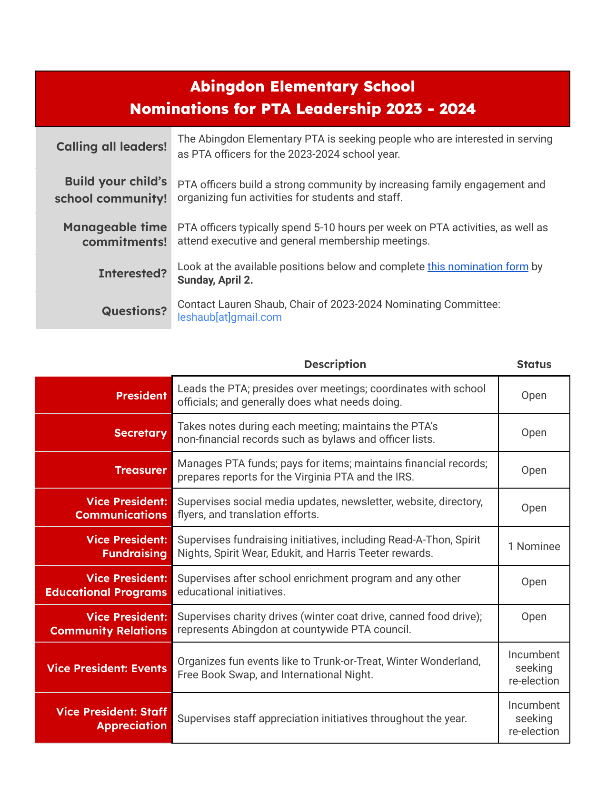

**Calling all leaders!** The Abingdon Elementary PTA is seeking people who are interested in serving as PTA officers for the 2023-2024 school year.

**Build your child’s school community!** PTA officers build a strong community by increasing family engagement and organizing fun activities for students and staff.

**Manageable time commitments!** PTA officers typically spend 5-10 hours per week on PTA activities, as well as attend executive and general membership meetings.

**Interested?** Look at the positions below and complete [this nomination form](https://docs.google.com/forms/d/e/1FAIpQLScPl5b8CzjnBYOVNXnR33plv3YKtS6cpMw67xFKSorHwZ7i5g/viewform?usp=share_link) by Sunday, April 2.

**Questions?** Contact Lauren Shaub, Chair of 2023-2024 Nominating Committee: leshaub[at]gmail.com



Any dues-paying PTA member may be a candidate for any officer position. The "status" is offered below for those interested in non-contested positions.



Here are the officer positions, their descriptions, and their status as of March 19:

| Role | Description | Status |
|-|-|-|
| 🦸 President | Leads the PTA; presides over meetings; coordinates with school officials; and generally does what needs doing. | Open |
| ✍️ Secretary | Takes notes during each meeting; maintains the PTA’s non-financial records such as bylaws and officer lists. | Open |
| 💰 Treasurer | Manages PTA funds; pays for items; maintains financial records; prepares reports for the Virginia PTA and the IRS. | Open |
| 📣 VP, Communications | Supervises social media updates, newsletter, website, directory, flyers, and translation efforts. | Open |
| 💵 VP, Fundraising | Supervises fundraising initiatives, including Read-A-Thon, Spirit Nights, Spirit Wear, Edukit, and Harris Teeter rewards. | 1 Candidate |
| 🎓 VP, Educational Programs | Supervises after school enrichment program and any other educational initiatives. | Open |
| 🏘️ VP, Community Relations | Supervises charity drives (winter coat drive, canned food drive); represents Abingdon at countywide PTA councils | Open |
| 🎉 VP, Events | Organizes fun events like to Trunk-or-Treat, Winter Wonderland, Free Book Swap, and International Night. | Incumbent seeking re-election |
| 🙏 VP, Staff Appreciation | Supervises staff appreciation initiatives throughout the year. | Incumbent seeking re-election |

