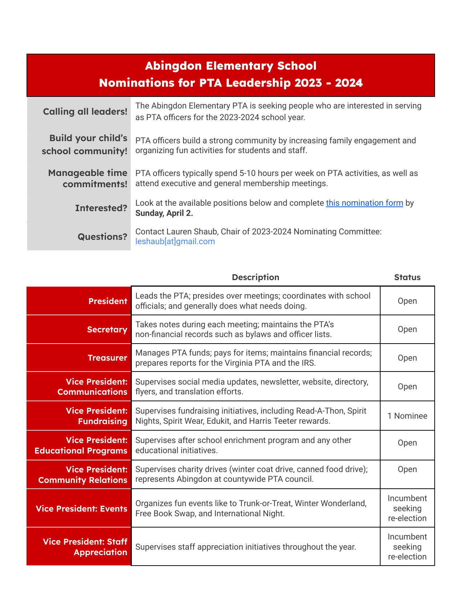

Click here to receive the Cardinal Courier newsletter in your inbox.

## 📅 Dates

- **March 24** — End of Read-a-thon
- **March 27** (6:00 PM) — Abingdon Tech Night
- **April 3-7** — Spring Break
- **April 10** — No School (Grade Preparation)
- **April 28** (5:30 PM - 7:30 PM) — International Night

## 🆕 New

### 🌎 International Night

Abingdon’s Annual International & Cultural Heritage and History Night is COMING! Last year’s event was a huge success thanks to the whole community who brought food and traditions to share, mingled, sang, danced, and volunteered throughout the beautiful night.




**This year**, we look forward to bringing our community together to celebrate the many various cultures that represent our student and staff population on **April 28th from 5:30 PM-7:30 PM**. We are excited to once again “break bread” together and learn traditions from one another. Please use the following [link](http://shorturl.at/wPTX7) to RSVP and let us know if you will be attending. We encourage families to consider sharing a dish from your culture, dress in traditional cultural attire, and invite you to share a cultural performance or tradition with the community. 

This event is a success **only** with your participation. Beyond joining in the fun, we also need **volunteers** to set up, work the event, and clean up at the end of the night. Please consider offering your time!



### 🙋 Nominations for PTA Leadership 2023-2024

- **Calling all leaders!** The Abingdon Elementary PTA is seeking people who are interested in serving as PTA officers for the 2023-2024 school year.
- **Build your child’s school community!** PTA officers build a strong community by increasing family engagement and organizing fun activities for students and staff.
- **Manageable time commitments!** PTA officers typically spend 5-10 hours per week on PTA activities, as well as attend executive and general membership meetings.
- **Interested?** Look at the positions below and complete [this nomination form](https://docs.google.com/forms/d/e/1FAIpQLScPl5b8CzjnBYOVNXnR33plv3YKtS6cpMw67xFKSorHwZ7i5g/viewform?usp=share_link) by Sunday, April 2.
- **Questions?** Contact Lauren Shaub, Chair of 2023-2024 Nominating Committee: leshaub[at]gmail.com

## 👉 Reminders

- 📚 **Read-A-Thon** is underway! Our students are on their journey around the world! They are taking planes, trains, automobiles to new destinations. As of Monday morning, our students have read 120,419 minutes and thanks to our partnership with you, our PTA has raised over $16,000! Help us meet our goal to raise $20,000 in our biggest fundraiser of the school year! 
    - If your student has not signed up, it is NOT too late. Join the Read-A-Thon by joining @ **https://www.read-a-thon.com/readers/r/AwAipj**. You will have the ability to share with family and friends who might donate to our PTA while you and your student track daily reading minutes. Remember, reading is reading! Track minutes for reading silently, aloud, solo, to a friend, a sibling, a stuffed animal, or a pet. Track minutes listening to a story aloud from a parent, a sibling, an audio recording! We appreciate your support of literacy and our fundraiser.



- 💻 **Abingdon Tech Night** will be held on Monday, March 27 from 6 to 7 PM in the school library.

## 🙏 Thank You

- 👕 Thank you to all those who ordered New Abingdon Spirit Wear. We are excited for it to come in so we can see all our community sporting their new Cardinal gear. We can’t wait to share how much $$$ we raised!