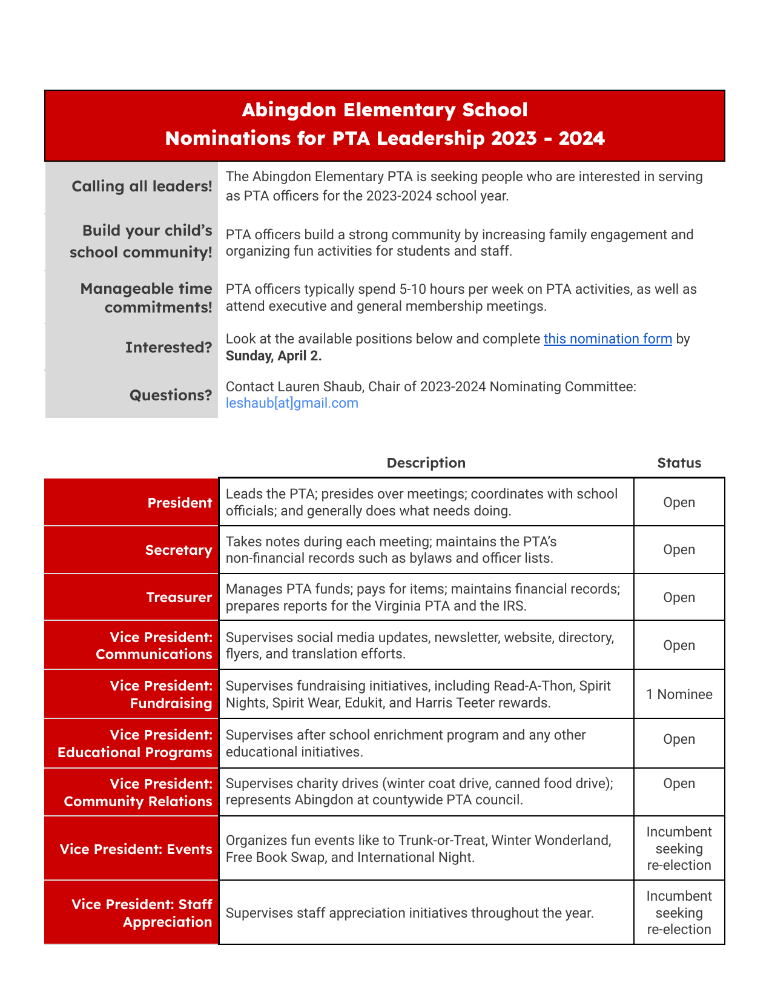

Haga clic aquí para recibir el boletín de Cardinal Courier en su bandeja de entrada.

## 📅 Fechas

- **24 de marzo** — Fin del maratón de lectura
- **27 de marzo** (6:00 p. m.) — Noche tecnológica de Abingdon
- **3-7 de abril** — Vacaciones de primavera
- **10 de abril** — No hay clases (preparación de calificaciones)
- **28 de abril** (5:30 p. m. - 7:30 p. m.) — Noche Internacional

## 🆕 Nuevo

### 🌎 Noche Internacional

¡Llega la Noche Anual de la Historia y el Patrimonio Cultural e Internacional de Abingdon! El evento del año pasado fue un gran éxito gracias a toda la comunidad que trajo comida y tradiciones para compartir, mezclarse, cantar, bailar y ser voluntarios durante la hermosa noche.




**Este año**, esperamos reunir a nuestra comunidad para celebrar las diversas culturas que representan a nuestra población de estudiantes y personal el **28 de abril de 5:30 p. m. a 7:30 p. m.**. Estamos emocionados de una vez más “partir el pan” juntos y aprender tradiciones unos de otros. Utilice el siguiente [enlace](http://shorturl.at/wPTX7) para confirmar su asistencia y avísenos si asistirá. Alentamos a las familias a considerar compartir un plato de su cultura, vestirse con atuendos culturales tradicionales y lo invitamos a compartir una actuación cultural o tradición con la comunidad.

Este evento es un éxito **solo** con tu participación. Más allá de unirnos a la diversión, también necesitamos **voluntarios** para organizar, trabajar en el evento y limpiar al final de la noche. ¡Por favor considere ofrecer su tiempo!



### 🙋 Nominaciones para el liderazgo de la PTA 2023-2024

- **¡Llamando a todos los líderes!** La PTA de Abingdon Elementary está buscando personas interesadas en servir como oficiales de la PTA para el año escolar 2023-2024.
- **¡Construya la comunidad escolar de su hijo!** Los oficiales de la PTA construyen una comunidad sólida al aumentar la participación familiar y organizar actividades divertidas para los estudiantes y el personal.
- **¡Compromisos de tiempo manejables!** Los funcionarios de la PTA generalmente dedican de 5 a 10 horas por semana a las actividades de la PTA, además de asistir a reuniones ejecutivas y generales de miembros.
- **¿Interesado?** Mire las posiciones a continuación y complete [este formulario de nominación](https://docs.google.com/forms/d/e/1FAIpQLScPl5b8CzjnBYOVNXnR33plv3YKtS6cpMw67xFKSorHwZ7i5g/viewform?usp=share_link) antes del domingo 2 de abril.
- **¿Preguntas?** Comuníquese con Lauren Shaub, Presidenta del Comité de Nominaciones 2023-2024: leshaub[at]gmail.com

## 👉 Recordatorios

- 📚 ¡**Read-A-Thon** está en marcha! ¡Nuestros estudiantes están en su viaje alrededor del mundo! Están llevando aviones, trenes, automóviles a nuevos destinos. ¡Hasta el lunes por la mañana, nuestros estudiantes han leído 120,419 minutos y gracias a nuestra asociación con ustedes, nuestra PTA ha recaudado más de $16,000! ¡Ayúdenos a alcanzar nuestra meta de recaudar $20,000 en nuestra recaudación de fondos más grande del año escolar!
     - Si su estudiante no se ha inscrito, NO es demasiado tarde. Únase al Read-A-Thon uniéndose a @ **https://www.read-a-thon.com/readers/r/AwAipj**. Tendrá la capacidad de compartir con familiares y amigos que podrían donar a nuestra PTA mientras usted y su estudiante registran los minutos de lectura diarios. Recuerda, ¡leer es leer! Haga un seguimiento de los minutos para leer en silencio, en voz alta, solo, a un amigo, un hermano, un animal de peluche o una mascota. ¡Haga un seguimiento de los minutos escuchando una historia en voz alta de un padre, un hermano, una grabación de audio! Agradecemos su apoyo a la alfabetización ya nuestra recaudación de fondos.



- 💻 **Abingdon Tech Night** se llevará a cabo el lunes 27 de marzo de 6 a 7 p. m. en la biblioteca de la escuela.

## 🙏 Gracias

- 👕 Gracias a todos los que ordenaron New Abingdon Spirit Wear. Estamos emocionados de que llegue para que podamos ver a toda nuestra comunidad luciendo su nuevo equipo Cardinal. ¡Estamos ansiosos por compartir cuánto $$$ recaudamos!