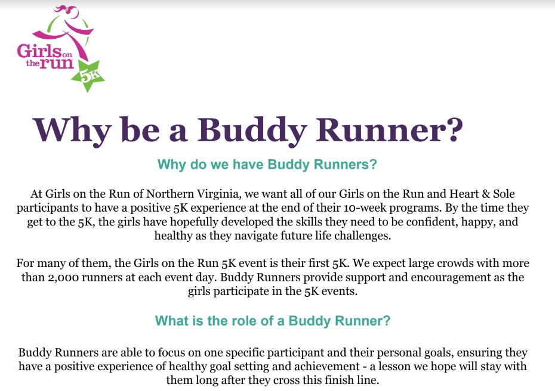

--- 
title: Girls on the Run Buddy Runners
summary: Girls on the Run is looking for "buddy runners," an adult who will run the course with participants.
slug: buddy runners
date: 2023-03-24T06:00:00-04:00
categories: "volunteer opportunities"
images: 
- /2023/03/24/buddy-runners/images/flyer.webp
---

The Abingdon Girls on the Run Team is off to a great start as we kicked off our re-entry season at Abingdon! Our students and coaches are enjoying setting star goals, getting to know one another, learning how to be strong and independent, and practicing our running. We have been confirmed for our 5K!

- WHEN: Sunday, May 21st at 8:30am
- WHERE: BASIS Independent School, 8000 Jones Branch Drive, McLean VA, 22012

Each GOTR student will need a 'buddy runner,' which is an adult to run the course with them. Please consider joining as a buddy runner. Many family members or friends will join their specific GOTR students, but some girls will not have an adult that they can run with. We encourage our Abingdon community to register to run and support. If you are interested, please reach out to Ashley Farrugia (ashleybethmccarthy@gmail.com) or Erin Mahaffey (eemahaffey@gmail.com).

Abingdon Girls on the Run participants do NOT need to register. 

Non-running volunteers are also needed on 5K day. GOTR NOVA will need people to help with packet pickup, race-day water stations, cheering, corralling, and several other race-related activities. If you are able to help, registration will be available in May; we will share the link as it comes available. 

Anyone can register, so share widely and let us know if you have any questions. Thank you!

