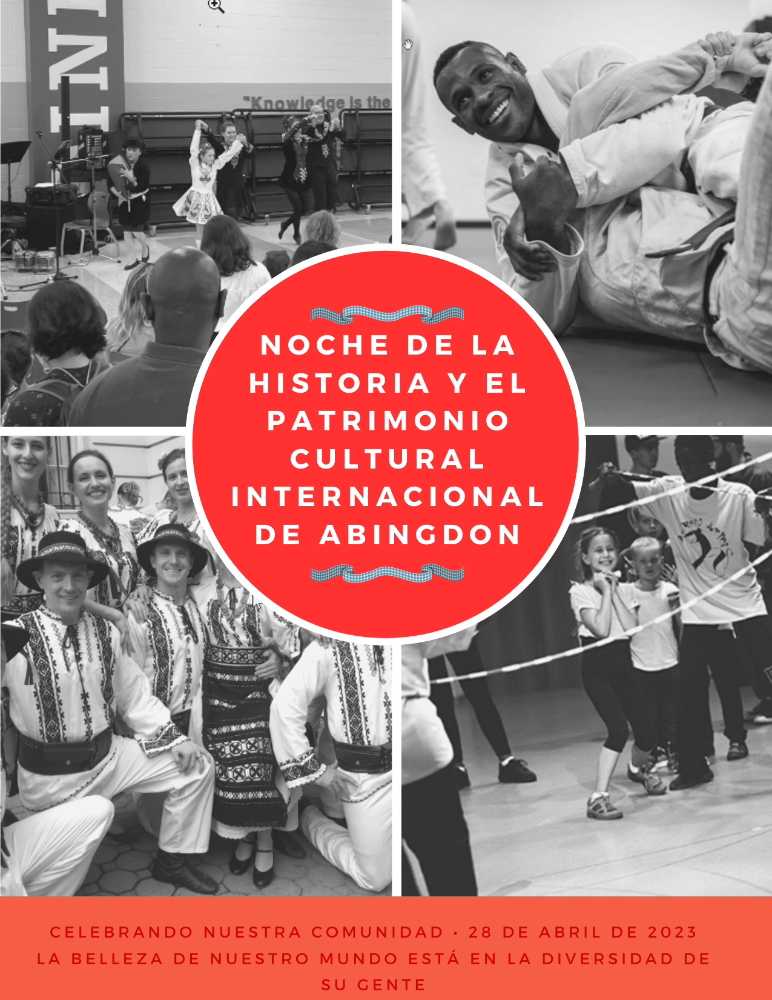
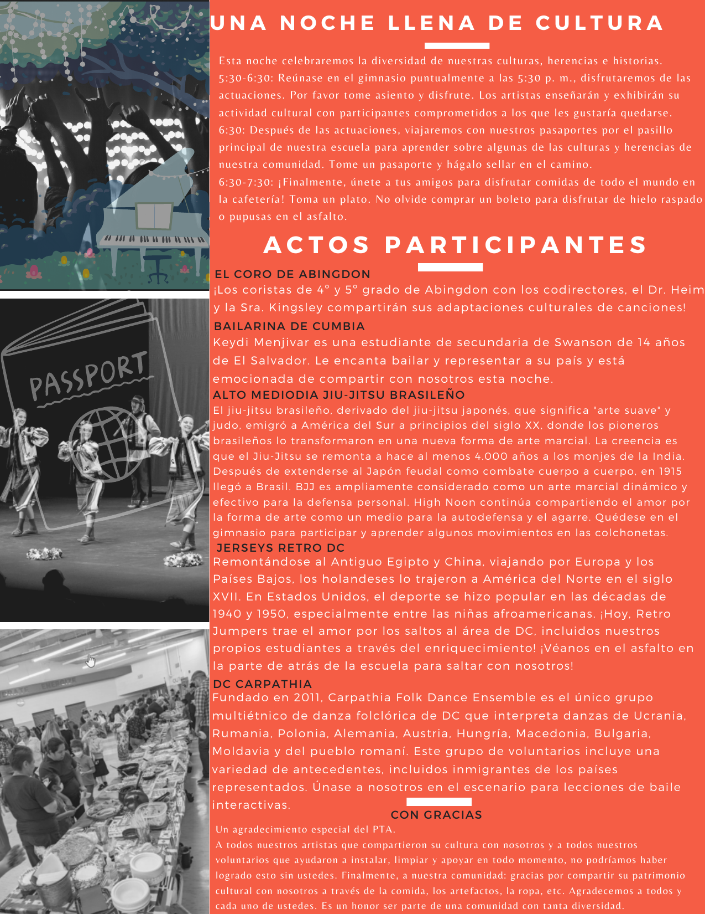
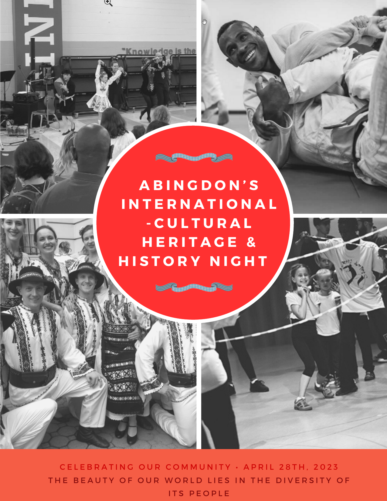
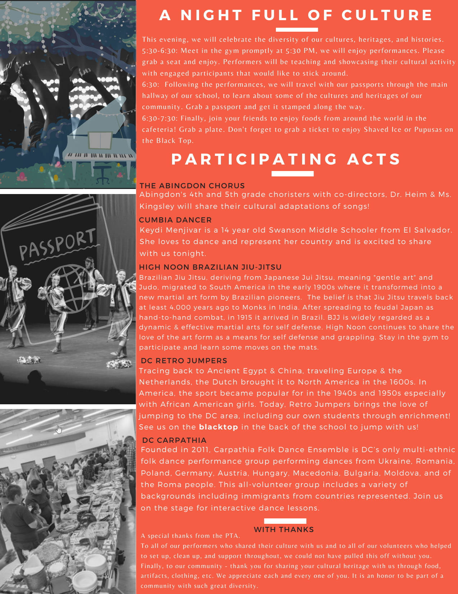

--- 
title: International & Cultural Heritage and History Night Program
summary: The program for International & Cultural Heritage and History Night is shared here.
slug: program
date: 2023-04-21T05:00:00-04:00
categories: events
images: ["files/flyer-es-1.png"]
---

The program for International & Cultural Heritage and History Night in Spanish and English is below.

## Abingdon's International-Cultural Heritage & History Night

Celebrating our community - April 28th, 2023

The beauty of our world lies in the diversity of its people

## A Night of Culture

This evening, we will celebrate the diversity of our cultures, heritages, and histories.
- 5:30-6:30: Meet in the gym promptly at 5:30 PM, we will enjoy performances. Please grab a seat and enjoy. Performers will be teaching and showcasing their cultural activity with engaged participants that would like to stick around.
- 6:30: Following the performances, we will travel with our passports through the main hallway of our school, to learn about some of the cultures and heritages of our community. Grab a passport and get it stamped along the way.
- 6:30-7:30: Finally, join your friends to enjoy foods from around the world in the cafeteria! Grab a plate. Don't forget to grab a ticket to enjoy Shaved Ice or Pupusas on the Black Top.

## Participating Acts

### DC Retro Jumpers

Tracing back to Ancient Egypt & China, traveling Europe & the Netherlands, the Dutch brought it to North America in the 1600s. In America, the sport became popular for in the 1940s and 1950s especially with African American girls. Today, Retro Jumpers brings the love of jumping to the DC area, including our own students through enrichment! See us on the blacktop in the back of the school to jump with us!

### Cumbia Dancer

Keydi Menjivar is a 14 year old Swanson Middle Schooler from El Salvador. She loves to dance and represent her country and is excited to share with us tonight.

### High Noon Brazilian Jiu-Jitsu

Brazilian Jiu-Jitsu, deriving from Japanese Jiu-Jitsu, meaning "gentle art" and Judo, migrated to South America in the early 1900s where it transformed into a new martial art form by Brazilian pioneers. The belief is that Jiu-Jitsu travels back at least 4,000 years ago to Monks in India. After spreading to feudal Japan as hand-to-hand combat, in 1915 it arrived in Brazil. BJJ is widely regarded as a dynamic & effective martial arts for self defense. High Noon continues to share the love of the art form as a means for self defense and grappling. Stay in the gym to participate and learn some moves on the mats.

### The Abingdon Chorus

Abingdon's 4th and 5th grade choristers with co-directors, Dr. Heim & Ms. Kingsley will share their cultural adaptations of songs!

### DC Carpathia

Founded in 2011, Carpathia Folk Dance Ensemble is DC’s only multi-ethnic folk dance performance group performing dances from Ukraine, Romania, Poland, Germany, Austria, Hungary, Macedonia, Bulgaria, Moldova, and of the Roma people. This all-volunteer group includes a variety of backgrounds including immigrants from countries represented. Join us on the stage for interactive dance lessons.

## With Thanks
                                    
A special thanks from the PTA.

To all of our performers who shared their culture with us and to all of our volunteers who helped to set up, clean up, and support throughout, we could not have pulled this off without you. Finally, to our community - thank you for sharing your cultural heritage with us through food, artifacts, clothing, etc. We appreciate each and every one of you. It is an honor to be part of a community with such great diversity.
