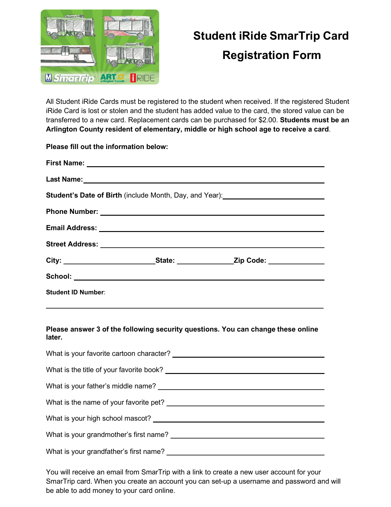
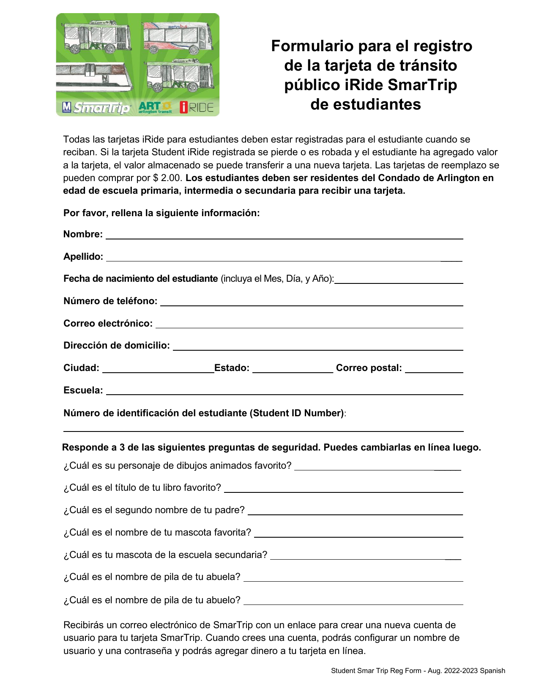
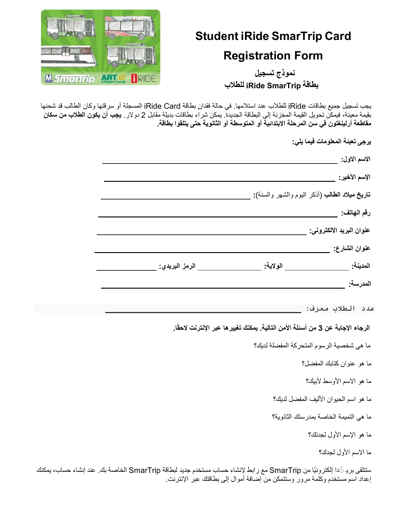
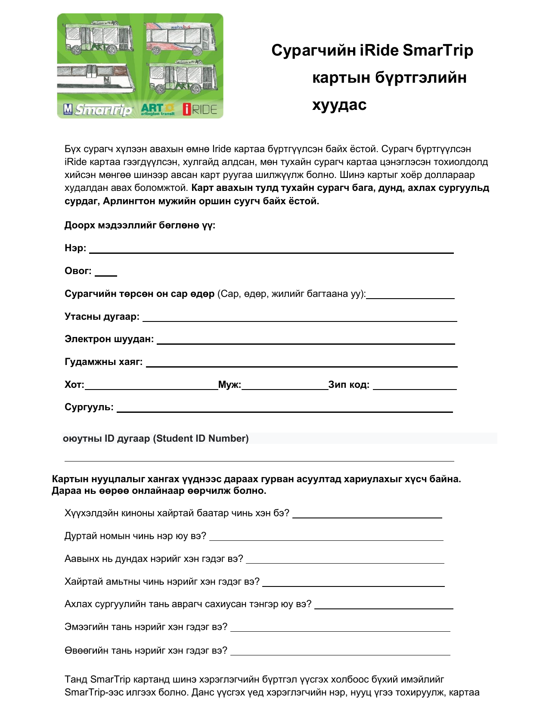
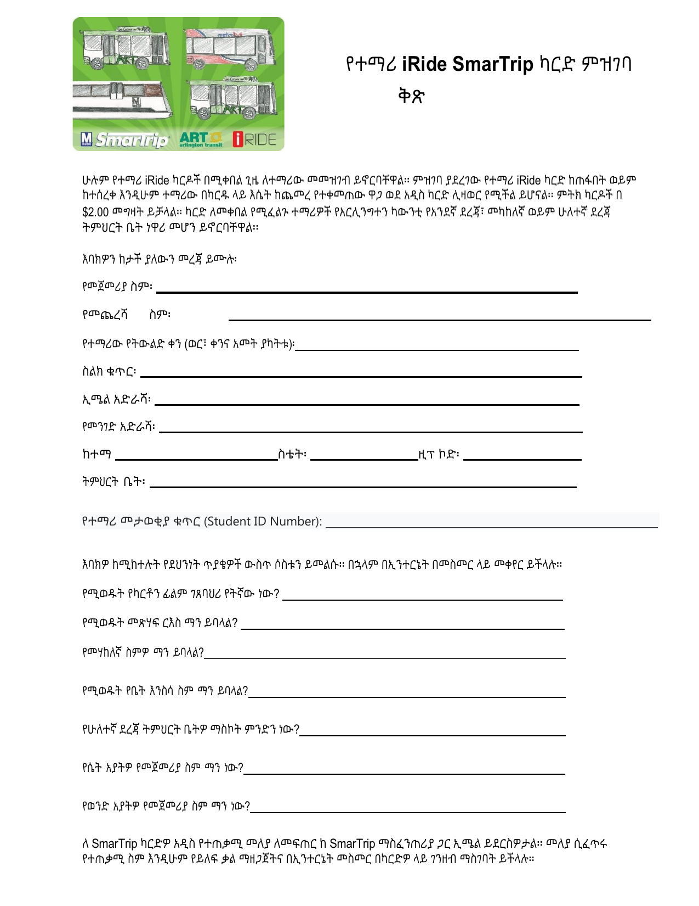

The PTA is passing along this message from Assistant Principal Anne Oliveira.

---

All students will need to have an iRide card to ride the ART buses for free starting May 1, 2023. Drivers will not be allowing students to ride without an iRide card. Apply for free student ART iRide card here: https://docs.google.com/forms/d/e/1FAIpQLSd_8WFV9g12-NTBhiSBwacmBXxVHNOpzi0b0gZVQyUsTSpgcQ/viewform Students will need to use their APS-issued device to register because the form goes through MyAccess.

