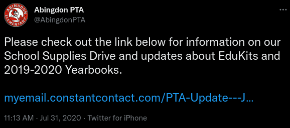

The Abingdon PTA organizes many donation drives for our school community.

If you're interested in helping to organize our donation drives, please [fill out our volunteer form](https://docs.google.com/forms/d/e/1FAIpQLSf50HFDkNfDxP5VfE2LzsxKbUPZdmRGQTeNEUhXkU_qLCLWZQ/viewform?usp=sf_link).

Click Here for the Latest News About Our Donation Drives

## Food Drives

The PTA organizes canned food drives, particularly during school events. A bin is placed in an accessible location and its contents are donated to the Arlington Food Assistance Center (AFAC).

The PTA also collects side dishes to complete the Thanksgiving dinners for Abingdon families in need.

  
During Winter Wonderland 2022, Abingdon collected 249 cans and 65 dry goods for AFAC - a total of 292 lbs of food!

## Clothing Drives

The PTA supports Abingdon families by collecting winter clothing for children to help share the warmth.

The PTA has also collected clothing to stock our "Extras Closet" for students who may need clothing/personal items during the school day.


  
**Left**: Donated winter coats, gloves, and hats. **Right**: Hats lovingly knitted and donated by a dedicated volunteer.

## Holiday Gift Card Drive

The Abingdon PTA partners with the Student Support Team at Abingdon to help support families in need during the holiday season in our school community by providing them with gift cards to local retailers. (This replaces the previous Adopt-a-Family program due to the desire of recipient families to select gifts for their children.)

<!--
## School Supplies Drive

The PTA raises money for school supplies for children whose families cannot afford them.

## Mask Drive

The PTA raised money to buy high-filtration masks to students, and also collected new masks in packaging to provide to students.

-->