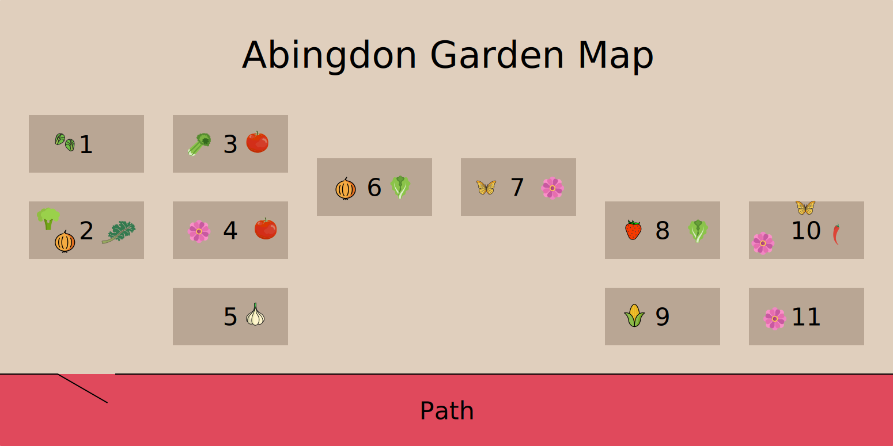

Abingdon Elementary would love your support to create a successful, sustainable community garden.  It is our goal to enrich students' and families' knowledge of environmental sustainability and to be good stewards of our Earth, while providing first hand experience in learning about our food supply and our pollinators.

Subscribe to our newsletter to learn about opportunities to help in the Abingdon Community Garden.

## What's New in the Garden?

Click Here for the Latest Garden News

## What's Growing?

Here's what's planted or growing in the garden in **Summer 2023**:

| Bed    | Plants |
| ------ | ------ |
| Bed 1  | Brussels Sprouts 🥬 |
| Bed 2  | Kale 🥬 Collards 🥬 Broccoli 🥬 Onions 🧅 Sage Thyme Lavender Black & Bloom Salvia Lemon Verbena |
| Bed 3  | Celery 🥬 Tomatoes 🍅 |
| Bed 4  | Tomatoes 🍅 Flowers 🌼 |
| Bed 5  | Garlic 🧄 |
| Bed 6  | Onions 🧅 Lettuce 🥬 |
| Bed 7  | Whorled Milkweed 🌿 New England Astor Black-eyed Susan Zinnia 🌼 |
| Bed 8  | Strawberries 🍓 Lettuce 🥬 Okra |
| Bed 9  | Corn 🌽 |
| Bed 10 | Butterfly weed 🦋 Zinnia 🌼 Peppers 🫑 |
| Bed 11 | Zinnias and other flowers 🌼 |

## Photos

### May Garden Cleanup
*May 21, 2023*










### Shed Ribbon Cutting
*April 23, 2023*




### Shed Construction
*February 18-19, 2023*









### MLK Day of Service 2023
*January 15, 2023*






### November Garden Cleanup
*November 6, 2022*











### September Garden Cleanup
*September 24, 2022*







### Summer Garden Cleanup
*August 7, 2022*






### Thriving Plants
*July 2022*











### Earth Day Cleanup
*April 2, 2022*









### Donation of Woodchips and Stumps from Lancaster Landscapes
*April 1, 2022*




### Winter Wonderland Cleanup
*February 12, 2022*





### MLK Day of Service 2022
*January 15, 2022*




### Before Cleanup
*December 12, 2021*






### Garden Setup
*May 12, 2018*






### Garden Founding
*April 19, 1991*

The Abingdon Garden was founded on April 19, 1991. We believe it was the first school garden in Arlington.

