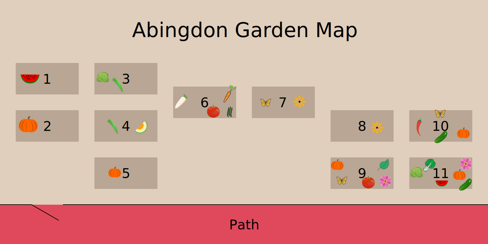

Abingdon Elementary would love your support to create a successful, sustainable community garden.  It is our goal to enrich students' and families' knowledge of environmental sustainability and to be good stewards of our Earth, while providing first hand experience in learning about our food supply and our pollinators.

If you're interested in volunteering in the garden, please click on the link below.

Click Here to Receive Updates About Garden Volunteer Opportunities

## What's Growing?

Here's what's growing in 2022:

| Bed    | Plants |
| ------ | ------ |
| Bed 1  | Watermelons |
| Bed 2  | Pumpkins |
| Bed 3  | Cabbage (front left) Okra (middle) Cabbage (right, harvested) |
| Bed 4  | Okra Cantaloupe |
| Bed 5  | Pumpkins |
| Bed 6  | Radishes (left) Tomatoes (middle) Beans (front right) Carrots (back right) |
| Bed 7  | Mint (back left and front right) Milkweed (everywhere else) |
| Bed 8  | Cabbage |
| Bed 9  | Pumpkin (left) Butterfly weed (left center) Tomato (middle) Basil (back right) Zinnia (front right) |
| Bed 10 | Peppers (left) Butterfly weed (back center) Cucumber (front center) Pumpkins (front right) |
| Bed 11 | Cabbage (left) Bok choy (center left) Watermelon (middle) Pumpkins (center right) Cucumber (front right) Zinnia (back right) |

## Photos

### Summer Garden Cleanup
*August 2022*






### Thriving Plants
*July 2022*











### Earth Day Cleanup
*April 2022*









### Donation of Woodchips and Stumps
*April 2022*




### Winter Wonderland Cleanup
*February 2022*





### MLK Day of Service
*January 2022*




### Before Cleanup
*December 2021*






### Garden Setup
*May 2018*




