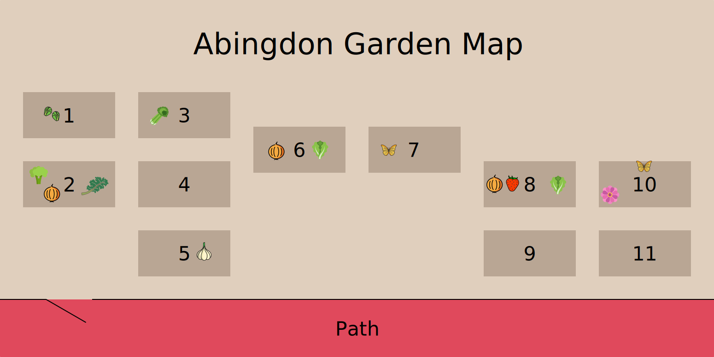

Abingdon Elementary would love your support to create a successful, sustainable community garden.  It is our goal to enrich students' and families' knowledge of environmental sustainability and to be good stewards of our Earth, while providing first hand experience in learning about our food supply and our pollinators.

If you're interested in volunteering in the garden, please click on the link below.

Click Here to Receive Updates About Garden Volunteer Opportunities

## What's New in the Garden?

Click Here for the Latest Garden News

## What's Growing?

Here's what's planted or growing in the garden in **winter 2022-2023**:

| Bed    | Plants |
| ------ | ------ |
| Bed 1  | Cover crop 🌾1 |
| Bed 2  | Kale 🥬 Collards 🥬 Leaves 🍂2 |
| Bed 3  | Cover crop 🌾1 |
| Bed 4  | Cover crop 🌾1 |
| Bed 5  | Garlic 🧄 (right) Daffodils 💮 Leaves 🍂2 |
| Bed 6  | Marigolds 🌼 Cover crop 🌾1 |
| Bed 7  | Milkweed 🌿 Clovers ☘️ |
| Bed 8  | Leaves 🍂2 |
| Bed 9  | Cover crop 🌾1 |
| Bed 10 | Butterfly weed 🦋 (back center) Cover crop 🌾1 |
| Bed 11 | Kale 🥬 Cover crop 🌾1 |

**1**: The cover crops we planted are hard red wheat, Danko Rye, Hairy Vetch, and medium red clover. [Cover crops](https://en.wikipedia.org/wiki/Cover_crop) protect and nourish the soil during winter.  
**2**: We covered some garden beds in leaves in order to keep their plants warm during the winter, and to add nutrients to the soil.

## Photos

### November Garden Cleanup
*November 6, 2022*











### September Garden Cleanup
*September 24, 2022*







### Summer Garden Cleanup
*August 7, 2022*






### Thriving Plants
*July 2022*











### Earth Day Cleanup
*April 2, 2022*









### Donation of Woodchips and Stumps
*April 1, 2022*




### Winter Wonderland Cleanup
*February 12, 2022*





### MLK Day of Service
*January 15, 2022*




### Before Cleanup
*December 12, 2021*






### Garden Setup
*May 12, 2018*




